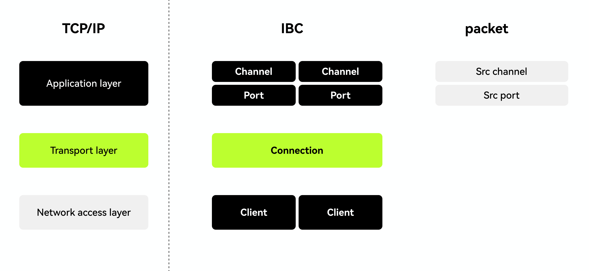
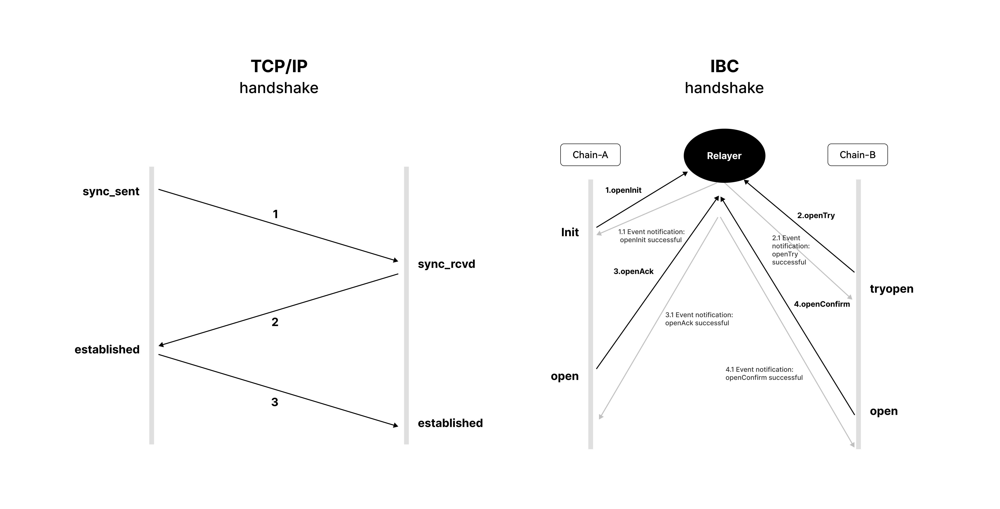
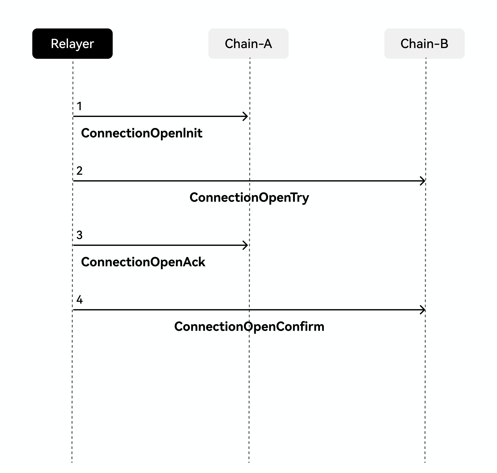
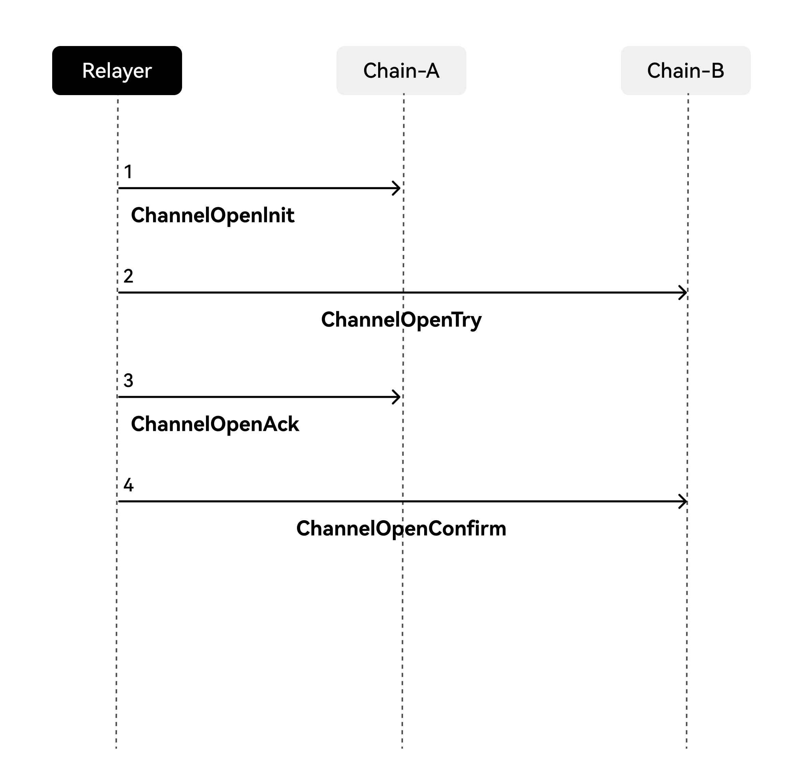
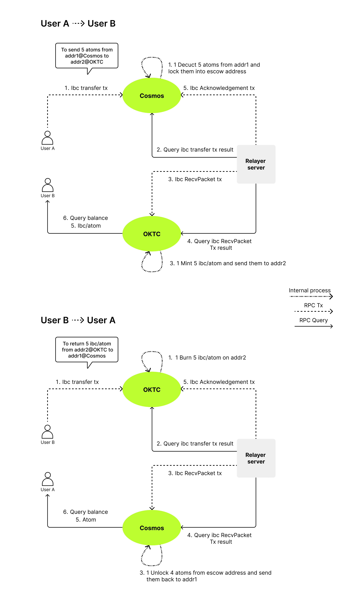

# IBC Overview

## **What is IBC?**

IBC, short for Inter-Blockchain Communication, was developed by Tendermint, Interchain Foundation, Agoric Systems and others, represents a portion of the broader Cosmos network ecosystem. The purpose of IBC is to help connect different blockchains all together with the simplest method possible. Currently speaking, some of the most popular blockchains-like Bitcoin or Ethereum-function on their own "islands", isolated from each other and the outside world. The IBC protocol comes in to solve this issue, acting as a social networking system for these blockchains, providing a means for them to communicate, exchange tokens and info with each other.

IBC is somewhat similar to the TCP protocol. Before the advent of TCP, the internet was a collection of individual computer networks, all lacking the means to effectively communicate with each other. But along with IP, TCP/IP was able to standardize the method of sending and routing data between separate computer networks, resulting in the seamless sharing of info on the modern internet we've all learned to enjoy. On that same note, IBC has done the same with the blockchain, hence why Cosmos is often referred to as "the internet of the blockchain".

The following are some of the common solutions used in regards to cross-chaining:

- Notary schemes: In essence, this is when two parties entrust a third party to validate and relay cross-chain data or interactions between the two parties. This method works well for supporting heterogeneous blockchains, but is considered a centralized method.
- Hash locking: first used in Bitcoin's Lighting Network, hash locking is a combination of hash lock and time lock in order to protect inter-blockchain asset transactions. Time lock is a time restriction set on transactions, cancelling out expired transactions; however, this method can only support asset trading but not transfers.
- Side chains: simply put, side chains are new chains built on existing chains, potentially different but still reliant on the original chains. Side chains work in tandem with their original chains, making up for areas in which the other chain lacks, thereby facilitating the transfer of assets between the two chains.

## **IBC core principles**

IBC is a combination of the notary scheme and side chain mechanisms, with a framework based on the multi-chain and multi-layer development of the relay chain. IBC's protocol is similar to that of TCP's, applying the layering design, as shown in the chart below:

- Client: Every chain has a corresponding client who is responsible for recording the info of the peer chain.

- Connection: Two client ends can create a connection.

- Port: In simple terms, a port is a specific application, such as token or NFT transferring.

- Channel: One port to another represents a channel, and one connection may contain many channels.

- Packet: a business data packet used for carrying business data, for example, cross-chain token transference data.

### **Handshake**

As the chart below shows, IBC's connecting mechanism is similar to TCP's three-way handshake, but one major difference between the two is that while the TCP/IP handshake is a direct end-to-end data interaction between two directly connected parties, IBC's connecting mechanism is done through a third party component called the relayer. The relayer conducts additional relay control and is different than TCP/IP in that IBC's connection/channel layer (chart above) needs to go through an additional connection creating process.

#### **Client layer protocol**

The client layer is IBC protocol's initial state and lowest layer, responsible for storing its peer network's metadata. The connection creating process of the client layer is as shown in the chart below:

In the client layer, IBC contains 4 different message types, as shown in the chart below:

|      | message            | Use                                                          | Trigger time                               | Caller                |
| ---- | ------------------ | ------------------------------------------------------------ | ------------------------------------------ | --------------------- |
| 1    | CreateClient       | Create a client, generate a unique client ID to store peer chain's metadata | While attempting to create the client      | Host chain/peer chain |
| 2    | UpdateClient       | Update client, maintain IBC client's vigor and security      | Anytime after creation of client           | Host chain/peer chain |
| 3    | UpgradeClient      | Upgrade peer chain's metadata, host chain executes synchronized update after receiving connection | If metadata needs to be modified           | Host chain            |
| 4    | SubmitMisbehaviour | Freeze client, renders status inactive                       | When the client exudes suspicious activity | Host chain            |

The chart below shows the client's recorded metadata:

|      | ChainId        | Use                                                          |
| ---- | -------------- | ------------------------------------------------------------ |
| 1    | ChainId        | peer block's ID, for example okbchaintest-196                      |
| 2    | TrustLevel     | Percentage of trusted node signatures, defaulted at 1/3      |
| 3    | TrustingPeriod | Client's validity period, judgement of peer chain's activity on host chain is determined by the analysis of this metadata |
| 4    | FrozenHeight   | Client exudes wrongful behavior, this field expresses that the Client is no longer valid |
| 5    | LatestHeight   | The most recent height of the peer chain on the host chain   |
| 6    | ProofSpecs     | metadata related to proof verification, for example hash algorithmn |
| 7    | MaxClockDrift  | time interval between each header info update                |

#### **Connection layer protocol**

Connection is the upper layer protocol of client and IBC protocol's transitional state. Connection layers connection creating process is similar to that of client's, both containing certain timed out sends which are reliant on relayer. Connection layer's connection structure is as shown in the chart below:

There are 4 different message categories in the connection layer, and each category's logic is described in the chart below:

|      | message               | use                                                          | trigger time                                                 | caller     |
| ---- | --------------------- | ------------------------------------------------------------ | ------------------------------------------------------------ | ---------- |
| 1    | ConnectionOpenInit    | Used to initiate the connecting subject                      | Upon creating connection, after client is created            | host chain |
| 2    | ConnectionOpenTry     | Creating connection, verifying and storing header info portion of the request | When the host chain completes sending, after ConnectionOpenInit | peer chain |
| 3    | ConnectionOpenAck     | Confirm connection creation, verifying and storing header info portion of the request | When the peer chain completes sending, after ConnectionOpenTry | host chain |
| 4    | ConnectionOpenConfirm | Peer chain confirms connection creation, verifying and storing header info portion of the request | When the host chain completes sending, after ConnectionOpenConfirm | peer chain |

#### **Channel layer protocol**

Channel layer is an application layer protocol, and all business developments can be found in this dimension. Taking place after the connection is created and reliant on relayer, a chart of channel layer protocol's connection structure is as shown below:

Below are 4 kinds of message categories in the channel layer and their corresponding logic's:

|      | message            | use                           | Trigger time                                              | Caller     |
| ---- | ------------------ | ----------------------------- | --------------------------------------------------------- | ---------- |
| 1    | ChannelOpenInit    | Initiate data channel         | Request to create channel                                 | host chain |
| 2    | ChannelOpenTry     | Initiate data channel         | After host chain completes sending, after ChannelOpenInit | peer chain |
| 3    | ChannelOpenAck     | Confirm data channel creation | After peer chain completes sending, after ChannelOpenTry  | host chain |
| 4    | ChannelOpenConfirm | Confirm data channel creation | After host chain completes sending, after ChannelOpenAck  | peer chain |

### **Relaying**

- The core component of the IBC protocol is relayer, which plays a sort of porter-like role in the protocol, relaying every transmitted message in IBC; in this protocol, the host chain never actively interacts with the peer chain, only ever passively receiving.

- Cosmos has officially implemented relayers in 3 different languages
    - [go version](https://github.com/cosmos/relayer)
    - [rust verison](https://github.com/informalsystems/hermes)
    - [ts version](https://github.com/confio/ts-relayer)

### **IBC security guarantee**

- Client activity verification

     There is a validity period field in the metadata of the client, which ensures that both clients are active and valid at the time. When the transaction is not active, in order to guarantee the client won't expire, there often will be regular updating intervals set up in the backend and program, as shown in the chart below:

     

   For each business request received by IBC, it must ensure that its lower layer client is valid, and only when it is in the active state will it receive transactions for business logic processing.

- Proof of hash

         After the relayer relays the data packet, the peer chain needs to verify the validity of the data packet, which is achieved through proof.

         The proof of IBC uses the ICS23 library, which is also the hash proof implemented by the Merkle tree. The calculation method is to start from the leaf node and calculate the root hash layer by layer, so that even a change in a portion of leaf nodes will affect the hash calculations of the overall data, thus avoiding the malicious tampering of data.

- Security verification of light nodes

   The two chains connected through the IBC protocol will maintain the light node information of the peer chain on their respective chains, with the security of the light node being equivalent to the security of the IBC protocol.

   When the relayer relays data packets, it also carries an UpdateClient message, which is used to update the light node consensus information. Conceptually speaking, the IBC protocol contains two key data structures, ClientState and ConsensusState, which separately store the metadata of the peer chain and consensus security information.

   When the node receives the message, the consensus layer will perform a double verification
    - 2/3 consensus
  
      IBC still mainly relies on the Tendermint consensus, which means that one of the core conditions is that the voting information of the header information in the light node must contain the signature information of 2/3 of the validators.

    - Trusted nodes>= 1/3
  
       In IBC, another core concept is TrustValidators, which are trusted nodes. After obtaining 2/3 consensus, 1/3 of the validator nodes must be TrustValidators before the light nodes data can be updated.

      > Note: theoretically speaking, 1/3 is considered insecure, because when the original 1/3 nodes go offline, the peer chain does not update the header information of the host chain in time, so if the original 1/3 nodes re-send the header information, the peer chain can still pass the verification.

### **Basic example**

Users on the Cosmos chain making asset transfers to the OKBC chain:

1. User A initiates an IBC transfer directed at the Cosmos chain. After Cosmos receives the transaction, it locks the corresponding balance in the A account, and generates a certificate, which is stored locally.

2. The relayer polls the transaction execution result from the Cosmos chain and packets it into RecvPacket.

3. The relayer sends the RecvPacket transaction to OKBC chain. After OKBC chain receives it, the respective minted token amount is given to the respective OKBC account, and an ack certificate is stored locally.

4. The relayer polls the RecvPacket transaction execution result from OKBC chain and packets it into Acknowledgemnt.

5. The relayer sends the Acknowledgemnt transaction to Cosmos chain. After that, Cosmos receives it and confirms if the OKBC chain execution is normal or not, if not, a refund is executed.

In conclusion, the entire process of token transference is as shown below:
  - Handshake and create a connection (Client=> Connection => Channel)
  - Transfer tokens
  - Wait for relayer to relay data packet

The only step in the entire process that requires the user to participate is "Initiate a transfer".

## **OKBC and IBC**

The bottom layer of OKBC is the early cosmos-sdk (v0.39), while IBC involves the code of v0.40+, and there are major code changes from 39 to 40. After the version upgrade, OKBC now not only supports the EVM system, but also supports IBC.

### **OKBC-ERC20**

Cross-chain native tokens are considered to have no commercial value on OKBC, and so after the arrival of cross-chain transferring of native tokens to OKBC, through the hooks function of IBC's application layer, the logic sunk down into the EVM layer. With ERC20, contracts were able to automatically generate the mapping of corresponding tokens, which caused everyone in the industry to focus on this one aspect. But finally, the barrier between Cosmos and EVM was broken down and a bridge between the two was built.

