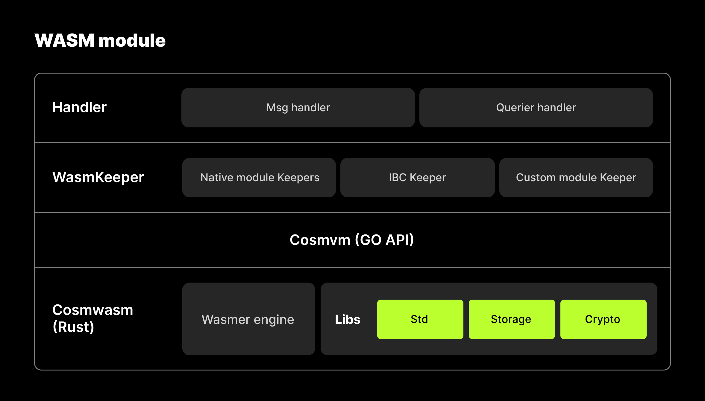

# Wasm Overview 
WebAssembly (abbreviated Wasm) is a binary instruction format for a stack-based virtual machine. Wasm is designed as a portable compilation target for programming languages, enabling deployment on the web for client and server applications or working as a virtual machine on blockchain.

Wasm of OKC is developed based on [CosmWasm](https://docs.cosmwasm.com/docs/1.0/). CosmWasm is a smart contracting platform built for the Cosmos ecosystem. Simply put, it's the Cosmos way of using WebAssembly hence the name.

CosmWasm is written as a module that can be plugged into the Cosmos SDK. This means that anyone currently building a blockchain using the Cosmos SDK can quickly and easily add CosmWasm smart contracting support to their chain, without adjusting existing logic.

[Rust](https://www.rust-lang.org/) is currently the most used programming language for CosmWasm, in the future, it is possible to have different programming languages like [AssemblyScript](https://www.assemblyscript.org/).

- [Architecture](#Architecture) explains much of the high-level design and architecture of CosmWasm. It is crucial to understand the mental model and capabilities of the system before designing products using it. However, if you prefer to learn by coding then you can skip this section and visit as you need it.
- [Wasm Smart Contract](#Wasm Smart Contract) introduces what wasm contract is and how to develop wasm contract.

## Architecture

### Wasm in OKC
   This architecture diagram mainly introduces the position of wasm in the entire OKC system. The bottom layer is Tendermint Core, on top of that is Cosmo's native module layer, then OKC's custom module layer, and the top layer is the API interface layer. Wasm is a module in OKC's custom module layer.
   

### Wasm system ecosystem
   CosmoWasm is a Cosmos SDK module plugin, this project is responsible for helping Cosmos SDK support wasm virtual machine. CosmWasm is implemented in Rust and because the Go code runtime causes the contract to enlarge, the contract is mainly written with Rust then compiled to wasm bytecode. In order to facilitate the interaction between the contract and virtual machine, the virtual machine also uses Rust as a fundamental database. In its entirety, CosmWasm's ecology is mainly divided into the following 3 parts:
- Contract standard database (similar to Ethereum's precompiled contract)
   + [cosmwasm-std](https://github.com/CosmWasm/cosmwasm/tree/main/packages/std): fundamental contract database, contains fundamental category definitions, defined with Cosmos SDK's fundamental module interaction information, IBC interface definitions, fundamental storage definitions, etc.
   + [cosmwasm-storage](https://github.com/CosmWasm/cosmwasm/tree/main/packages/storage): used in conjunction with cosmwasm-std, is the post-package for storing related data structures in cosmwasm-std.
   + [cw-storage-plus](https://github.com/CosmWasm/cosmwasm-plus/tree/main/packages/storage-plus): the higher level post-package of cosmwasm-storage, used for compiling more complex modern contracts, but currently most are still unstable
- Contract tools, includes contract template, contract sample and contract compilation optimization tools.
   + [cosmwasm-template](https://github.com/CosmWasm/cosmwasm-template): a tool used for generating wasm contract templates, can generate contract templates, unit testing templates, ABI interface templates, etc., all with one click.
   + [rust-optimizer](https://github.com/cosmwasm/rust-optimizer): a docker image, used for compiling and optimizing Rust contracts, and also outputting wasm bytecode. The size of the contract bytecode compiled in the image is smaller, and at the same time, it ensures that different developers have the same compilation environment for the same contract, thereby ensuring that the generated wasm contracts have the same checksum (for on-chain and contract interaction).
- Contract virtual machine
   + [cosmwasm-vm](https://github.com/CosmWasm/cosmwasm/tree/main/packages/vm): Rust is based on wasmer engine virtual machine, used for fulfilling the contract execution needs of the host environment, calculating gas consumption; it is the core module for executing wasm contracts.

The relationship of different parts and the internal framework of CosmWasm is as shown in the diagram below:

### More information  
   For more information, please refer to [architecture](https://docs.cosmwasm.com/docs/1.0/architecture/multichain).

## Wasm Smart Contract
### Advantages compared to EVM and solidity
   Wasm's smart contract operates on wasm virtual machine's smart contract. Wasm virtual machine is more advanced than EVM, these are its main advantages:
1. Faster speed, lower gas consumption
2. Can operate more complex contracts
3. Supports Rust, Go, C/C++ and other popular programming languages for developing contracts
4. Cosmos IBC Can seamlessly link with Cosmos IBC
   Currently speaking, Rust is the main programming language used for developing wasm contracts
### Advanced tutorials for further learning
   Smart contract aims to clarify the semantics of how a CosmWasm contract interacts with its environment and data structure of a CosmWasm contract. Learn demonstrates developing smart contracts from zero to production with step by step explanations, code snippets, scripts and more.
- [Dev Academy](https://docs.cosmwasm.com/dev-academy/intro) provides structured learning content starting from basics of blockchains and smart contracts to Cosmos SDK, CosmWasm smart contracts and clients.
- [Tutorials](https://docs.cosmwasm.com/tutorials/hijack-escrow/intro) demonstrates developing smart contracts from zero to production with step by step explanations, code snippets, scripts, and more.
- [Workshops](https://docs.cosmwasm.com/tutorials/videos-workshops) has a great collection of demonstrations and verbal explanations of CosmWasm tech stack recorded in various events and organizations.
- [Plus](https://docs.cosmwasm.com/cw-plus/0.9.0/overview) is for state-of-the-art, production ready CosmWasm smart contracts.
- [Repository](https://github.com/CosmWasm/cosmwasm) has more code details for CosmWasm.   

> Wasm has no gas refund compared to evm.
