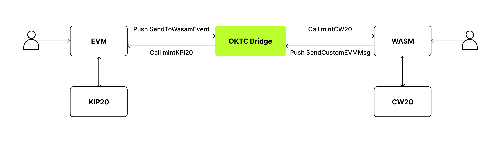
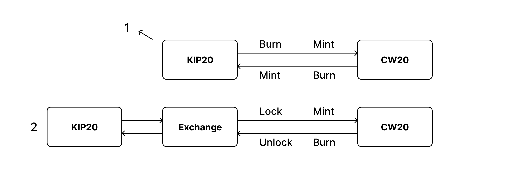

# VMBridge
VMBridge provides OKTC with a channel for EVM contracts and WASM contracts to call each other. Contract developers only need to implement simple code to use VMBridge for cross-virtual machine calls.
1. If you need to call a WASM contract from an EVM contract, you can simply throw the `__OKCCallToWasm` event in the EVM contract to complete the WASM contract call.
2. If you need to call an EVM contract from a WASM contract, you can simply throw the `CallToEvmMsg` event in the WASM contract to complete the EVM contract call.

Below is a diagram illustrating the principles of VMBridge:

## Example of application
**We have provided an [example](https://github.com/okx/vmbridge-examples) that demonstrates how to use VMBridge.**

This example contract is a counter application. You can call the `add` method of the WASM contract in the EVM contract to perform addition operations on the WASM contract. You can also call the `add` method of the EVM in the WASM contract to perform addition operations on the EVM contract.

The following diagram illustrates how EVM calls WASM:


## Detailed explanation of development rules
To enable cross-virtual machine calls for your contract through VMBridge, it must comply with the following rules.

### EVM  call WASM
Throw out the following events to call a WASM contract:

```solidity
event __OKCCallToWasm(string wasmAddr, uint256 value，string calldata);
```
- `wasmAddr`: The called WASM contract. It should be string. (For example 0x5A8D648DEE57b2fc90D98DC17fa887159b69638b)
- `value`: When calling a WASM contract, the amount of OKT tokens to be transferred to the contract can be specified. It’s important to note that a WASM contract does not have a **payable** concept like EVM contracts do.
- `calldata`: To call a WASM contract, parameters such as the method name and its parameters should be specified. It’s similar to an **ABI**.

**Notice:**
> 1.  EVM calls to WASM can only confirm if the call was successful but can not return the value of the called WASM method.
> 2. Multiple instances of __OKCCallToWasm can be thrown, and this will result in multiple calls to the WASM contract.
> 3. The called WASM contract will only execute after all the logic in the internal EVM contract has been completed.
> 4. After EVM calls a WASM contract, the WASM contract may use CallToEvmMsg to call an EVM contract. Even if the EVM contract throws __OKCCallToWasm, the WASM contract will not be called.
> 5. calldata is the **hex-encoded message** received by the WASM contract.

```solidity
//follow is example of hex-encoded which is call wasm a method that is named transfer 
//{"transfer":{"amount":"100","recipient":"ex1eutyuqqase3eyvwe92caw8dcx5ly8s544q3hmq"}}
calldata = hex.DecodeString([]byte("{\"transfer\":{\"amount\":\"100\",\"recipient\":\"ex1eutyuqqase3eyvwe92caw8dcx5ly8s544q3hmq\"}}"))
```
### Wasm call EVM
Once a WASM contract throws CallToEvmMsg, the corresponding EVM contract method can be called, and the result of the execution will be returned to the reply method of the WASM contract once the EVM contract execution is complete.


```rust
pub struct CallToEvmMsg {
    pub sender: String, 
    pub evmaddr: String,
    pub calldata: String, 
    pub value: Uint128, 
}

impl Into<CosmosMsg<CallToEvmMsg>> for CallToEvmMsg {
    fn into(self) -> CosmosMsg<CallToEvmMsg> {
        CosmosMsg::Custom(self)
    }
}

impl CustomMsg for CallToEvmMsg {}

pub struct CallToEvmMsgResponse {
    pub response: String,
}
```
- A WASM contract must implement CallToEvmMsg, and this Msg must be a subclass of **CosmosMsg::Custom**.
- `sender`: The address of the WASM contract.The sender’s address must be the address of the calling contract. You can find _env.contract.address by using env.
- `evmaddr`: The address of the EVM contract.
- `calldata`: The parameters for calling the EVM contract, such as the method name and parameters, must be specified as an ABI and **hex-encoded**.
- `value`: The amount of OKT tokens to be transferred to the EVM contract when calling its methods can also be specified. It’s important to note that EVM contract methods may or may not be payable, so it’s essential to check before sending any tokens.

**Notice:**
> 1. When calling an EVM contract from a WASM contract, it’s necessary to obtain CallToEvmMsgResponse to confirm if the call was successful.
> 2. The response of CallToEvmMsgResponse is encoded as an **ABI**, which means that you need to decode the result if you require specific values.
> 3. If an EVM contract throws a __OKCCallToWasm event after being called from a WASM contract, it won’t call the WASM contract.
> 4. When calling an EVM contract from a WASM contract, the calldata must be hex-encoded ABI data corresponding to the method call of the EVM contract without the "0x" prefix.
