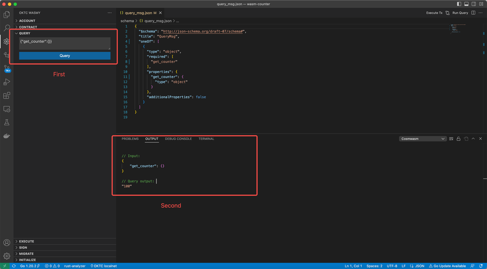

# VSCode + Cosmy Wasmy in WASM contract development
This article provides a guide on how to develop, compile, and optimize Wasm smart contracts on OKT Chain (OKTC) by using VSCode and the Cosmy Wasmy plugin. It also covers how to call and query these contracts on OKTC.

Cosmy Wasmy simplifies the development and interactions of CosmWasm smart contracts. By using a preconfigured file to connect to the OKTC network, testing and interacting with OKTC becomes much easier. With Cosmy Wasmy, you can perform all OKTC interactions without having to use the CLI.

## Environment configuration

In this section, we'll prepare our machines and install the necessary tools for developing, deploying, and interacting with smart contracts on OKTC.

### Install OKTC

Make sure you've installed the OKTC application: [Installation tutorial](https://www.okx.com/okbc/docs/dev/quick-start/build-on-okbc/install-okbc).

### Install Rust

Install the Rust environment (Linux or MacOS):  [Installation tutorial](https://www.okx.com/okbc/docs/dev/quick-start/build-on-okbc/install-okbc).

After successfully installing Rust, make sure your machine has the Wasm32 target.

```shell
rustup default stable
cargo version
# If this is lower than 1.55.0+, update
rustup update stable

rustup target list --installed
rustup target add wasm32-unknown-unknown
cargo install cargo-run-script
```

### **Install Docker**

```shell
# reference
https://www.docker.com/

# Set $USER into docker group on ubuntu
sudo gpasswd -a $USER docker 
newgrp docker
```

### Install plugin

You can install `Cosmy Wasmy` from [Visual Studio Marketplace](https://marketplace.visualstudio.com/items?itemName=spoorthi.cosmy-wasmy), or you can search for `Cosmy Wasmy` in the sidebar next to vscode Extensions. The following should appear on your screen when you've completed the installation:


After completing the installation, it's recommended that you configure your plugin settings; the following are the next steps you would take to do this.

#### 1.Select your destination chain

This extension pre-configures some chain lists that support Cosmsm Wasm, and you can choose `OKTC localnet` or `OKTC testnet`


You can also type `Command + Shift + P` in the VSCode command panel, and enter `cosmy-wasmy.reloadConfig` to configure.

####  2.Import account

If you already have test accounts, you can add a new account in the Account sidebar and upload them with it. Or you can just create a new account.


> Note: Please don't use your mainnet account here; and mnemonics are stored in vscode as plain text.

####  3.Import contract  

You can import the address of any contract that was deployed on your chain here:


## Plugin function overview (recommended)

| **Title**               | **Command**                  | **Key binding** | **Details**                                                  |
| ----------------------- | ---------------------------- | --------------- | ------------------------------------------------------------ |
| Set up dev environment  | cosmy-wasmy.setupDevEnv      |                 | Installs rust and cargo dependencies                         |
| Build                   | cosmy-wasmy.build            | ctrl+shift+b    | Builds the project and generates the non-optimized Wasm file |
| Run unit tests          | cosmy-wasmy.runUnitTests     | ctrl+shift+t    | Runs all the unit tests in the project                       |
| Optimize contract       | cosmy-wasmy.optimizeContract | ctrl+shift+o    | Runs the docker contract-optimizer and generates an optimized Wasm artifact - Needs docker running |
| Generate schema         | cosmy-wasmy.generateSchema   | ctrl+shift+g    | Generates json-schema using the Rust schema files. This enables autocomplete for the query and tx json |
| Upload contract         | cosmy-wasmy.upload           | ctrl+shift+u    | Uploads a Wasm file to selected chain with selected account. Right-clicking on a Wasm file shows this command in the context menu or command can be invocated using command palette/key binding and file dialog opens to select a Wasm file. Can also be invoked by clicking on the Upload icon in the Contract view. |
| Reload chain config     | cosmy-wasmy.reloadConfig     |                 | Opens a quick pick menu for the user to pick a new chain for the current workspace |
| Reset data              | cosmy-wasmy.resetData        |                 | Deletes all the extension stored data, like accounts and contracts. |
| Show Cosmwasm history   | cosmy-wasmy.history          | ctrl+shift+a    | Shows latest queries and transactions and with saved inputs. Allows easy re-execution of same queries. The number of saved queries is configurable in the settings. |
| Export Cosmy Wasmy data | cosmy-wasmy.export           |                 | Export imported accounts, all imported contracts, and history as a JSON file. Be careful sharing this file with others as it'll include your seed phrase. |

## Using plugin

### Auto interaction (recommended)


### Account

#### **Copy Address**


#### **Copy mnemonic**


#### Refresh account


#### DeleteAccount


### Contract

#### Upload


#### Import


#### Copy address


#### Note


#### Update admin


### Interaction

#### Intialize


#### Execute


#### Query


#### History


### NodeBook

#### Create


#### Run


## Step-by-step on How to Deploy Wasmy-counter

Wasmy-counter is a counting contract with (`Add`), (`Subtract`), and (`GetCounter`) functions. This article will use the Wasmy-counter contract as an example to introduce the entire process of developing, compiling, deploying, and interacting with smart contracts on OKTCWasm using the Cosmy Wasmy plugin. The content is suitable for all learners, regardless of their experience in Rust or Go. The goal of this article is to provide easy-to-understand instructions and first-hand experience for first-time users through the following step-by-step guide:

- Contract compilation: Demonstrate how to download and compile smart contract code into a Wasm bytecode file.
- Optimization compilation: Demonstrate how to optimize the Wasm bytecode file to an appropriate size.
- Contract code upload: Demonstrate how to upload the compiled contract code (Wasm file) to the blockchain. 
- Contract initialization: Demonstrate how to initialize a contract based on the contract code.
- Contract invocation: Show how to deploy the contract to the testnet, instantiate it, and execute the smart contract functions.
- Contract query: Demonstrate how to query the internal state of the contract.

You may have noticed that writing smart contracts isn't within the scope of this section. This section is intentionally customized to make it as easy to understand as possible and avoid the complex risks of smart contract development. If you want to learn more about OKCWasm contract code development, you can refer to the [CosmWasm documents](https://docs.cosmwasm.com/docs/), as OKCWasm is developed based on CosmWasm.

### Contract compilation

1.Pull the Wasmy-counter contract code, and use VSCode to open the project

```Bash
git clone https://github.com/okx/wasmy-counter

# Use VSCode to open the project, or open VSCode，File > Open Folder...  
code wasmy-counter
```

2.Contract code compilation

- Compile the code. Compile the unoptimized Wasm file through the command line `ctrl+shift+b`, or open the VSCode command panel `Command+Shift+P`, and compile by entering `cosmy-wasmy.build`

- Generate the Schema file. Compile the Schema file through the command line `ctrl+shift+g`, or open the VSCode command panel `Command + Shift + P`, and generate it by entering `cosmy-wasmy.generateSchema.`

### Optimized compilation

> Note: You need to start the docker program, and ensure that the development environment has been set up (open the VSCode command panel `Command + Shift + P`, and set the environment by entering `cosmy-wasmy.setupDevEnv`).

To keep gas costs down, the binary size should be as small as possible. This reduces deployment costs and lowers the cost per interaction.

Optimize the Wasm file through the command line `ctrl+shift+o`, or open the VSCode command panel `Command + Shift + P`, and optimize by entering `cosmy-wasmy.optimizeContract`

### Contract code upload

There are 3 methods for uploading code

1. Upload the contract through the panel window (recommended)
   1. Select Cosmy Wasmy plugin on the panel to the left
   
   2. Select an account
   
   3. Click Upload contract button, select the optimized Wasm folder, e.g. `./artifacts/wasm_counter.wasm`
   
      
   
2. Right-click to upload contract
   1. Select Cosmy Wasmy plugin in the panel to the left
   2. Select an account
   3. In the file bar, right-click the `Upload Contract` button


1. Command line to upload contract
   1. Select Cosmy Wasmy plugin in the panel to the left
   2. Select an account
   3. Open the window and select a file through the command line `ctrl+shift+u`, or open the VSCode command panel `Command + Shift + P`, and open the file by entering `cosmy-wasmy.upload`

After the contract is successfully uploaded, the corresponding contract Code ID will be generated. Please record this value, which will be used for subsequent initialization of the contract.


### Contract initialization

After uploading the contract code, it is saved in the blockchain but has not yet been initialized as a specific contract. Developers can use the uploaded code and corresponding initialization parameters to initialize a Wasm smart contract and get a contract address.

- Select Cosmy Wasmy plugin in the panel to the left
- Select an account
- In the INITIALIZE panel, enter the contract code ID, contract label, contract admin address (optional, default ""), contract initialization amount (optional), and contract initialization string. Then click Initialize + Import to initialize the contract. If successful, the generated contract account address can be seen in CONTACT. The name is composed of: Code ID: Label + address.


> What is a contract initialization string? It is the parameters in JSON type to be used to instantiate the contract. And we can find the schema in `wasmy-counter/schema/instantiate_msg.json`

```JSON
{
  "$schema": "http://json-schema.org/draft-07/schema#",
  "title": "InstantiateMsg",
  "type": "object",
  "required": [
    "init_count"
  ],
  "properties": {
    "init_count": {
      "$ref": "#/definitions/Uint256"
    }
  },
  "definitions": {
    "Uint256": {
      "description": "An implementation of u256 that is using strings for JSON encoding/decoding, such that the full u256 range can be used for clients that convert JSON numbers to floats, like JavaScript and jq.\n\n# Examples\n\nUse `from` to create instances out of primitive uint types or `new` to provide big endian bytes:\n\n``` # use cosmwasm_std::Uint256; let a = Uint256::from(258u128); let b = Uint256::new([ 0u8, 0u8, 0u8, 0u8, 0u8, 0u8, 0u8, 0u8, 0u8, 0u8, 0u8, 0u8, 0u8, 0u8, 0u8, 0u8, 0u8, 0u8, 0u8, 0u8, 0u8, 0u8, 0u8, 0u8, 0u8, 0u8, 0u8, 0u8, 0u8, 0u8, 1u8, 2u8, ]); assert_eq!(a, b); ```",
      "type": "string"
    }
  }
}
```

The instantiate message has `init_count` field, so the instantiate message can be:

```JSON
{"init_count":"100"}
```

### Contract call

After contract initialization, any user can initiate contract calls to the contract.


Many methods are included in the Wasmy-counter contract, with each method having a corresponding execute message. Therefore, only the `add` method is used as an example to introduce the contract call.

Execute message schema of `add` method in  `schema/execute_msg.json`:

```JSON
{
  "$schema": "http://json-schema.org/draft-07/schema#",
  "title": "ExecuteMsg",
  "oneOf": [
    {
      "type": "object",
      "required": [
        "add"
      ],
      "properties": {
        "add": {
          "type": "object",
          "required": [
            "delta"
          ],
          "properties": {
            "delta": {
              "$ref": "#/definitions/Uint256"
            }
          }
        }
      },
      "additionalProperties": false
    },
    {
      "type": "object",
      "required": [
        "subtract"
      ],
      "properties": {
        "subtract": {
          "type": "object"
        }
      },
      "additionalProperties": false
    }
  ],
  "definitions": {
    "Uint256": {
      "description": "An implementation of u256 that is using strings for JSON encoding/decoding, such that the full u256 range can be used for clients that convert JSON numbers to floats, like JavaScript and jq.\n\n# Examples\n\nUse `from` to create instances out of primitive uint types or `new` to provide big endian bytes:\n\n``` # use cosmwasm_std::Uint256; let a = Uint256::from(258u128); let b = Uint256::new([ 0u8, 0u8, 0u8, 0u8, 0u8, 0u8, 0u8, 0u8, 0u8, 0u8, 0u8, 0u8, 0u8, 0u8, 0u8, 0u8, 0u8, 0u8, 0u8, 0u8, 0u8, 0u8, 0u8, 0u8, 0u8, 0u8, 0u8, 0u8, 0u8, 0u8, 1u8, 2u8, ]); assert_eq!(a, b); ```",
      "type": "string"
    }
  }
}
```

One of the `execute` messages is `add` message, and transfer message can be:

```json
{"add":{"delta":"100"}}
```

### Contract query

The contract status usually changes after a contract call, so this can also be used to verify if the contract logic is correct.



Wasmy-counter defines the query interface and has a corresponding query_message.

Query message schema of `balance` query in  `./wasmy-counter/schema/query_msg.json`:

```json
{
  "$schema": "http://json-schema.org/draft-07/schema#",
  "title": "QueryMsg",
  "oneOf": [
    {
      "type": "object",
      "required": [
        "get_counter"
      ],
      "properties": {
        "get_counter": {
          "type": "object"
        }
      },
      "additionalProperties": false
    }
  ]
}
```

So the query message can be:

```json
{"get_counter":{}}
```

Query result return value, define through`./schema/count_response.json`

```JSON
{
  "$schema": "http://json-schema.org/draft-07/schema#",
  "title": "CountResponse",
  "type": "object",
  "required": [
    "count"
  ],
  "properties": {
    "count": {
      "type": "integer",
      "format": "int32"
    }
  }
}
```

The final result:

```Bash
"100"
```

## Wasm contract management

For an introduction to the functions and principles of Wasm contract management and permission management, please refer to [Permissions management for Wasm smart contracts.](https://www.okx.com/cn/okbc/docs/dev/building-modules/wasm-module/okbc-wasm-instruction-manual#permissions-management-for-wasm-smart-contracts) This article only introduces the process of using the Cosmy Wasmy plugin to manage Wasm contracts.

### Contract upgrade


### Contract permission management

