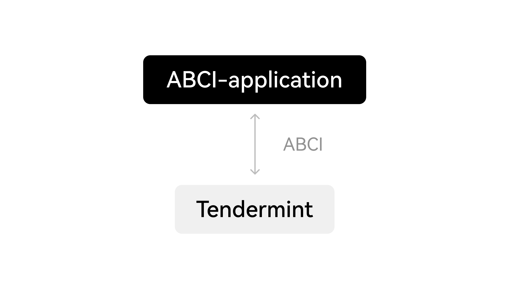
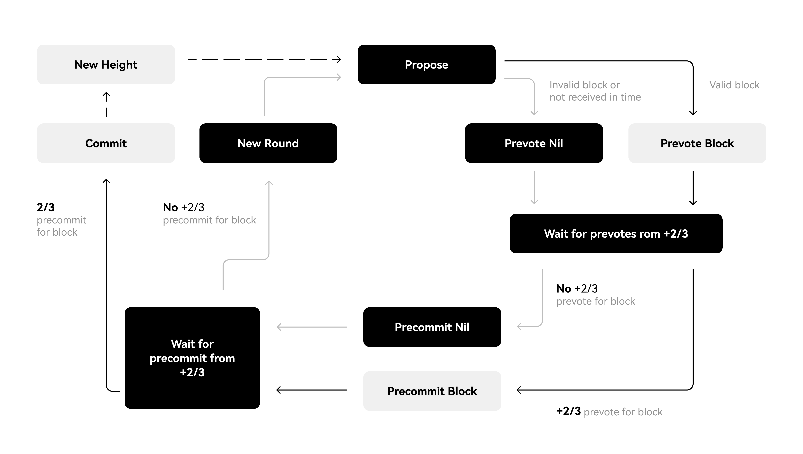

# Basic Concepts

## Types of OKC nodes

### Full node

A Full Node in Tendermint is a type of node that maintains a complete and up-to-date copy of the blockchain ledger. It validates all transactions, executes smart contracts and is capable of participating in the consensus process. Full nodes play a critical role in ensuring the security and resilience of the blockchain network by independently verifying all transactions and blocks. They provide other applications and nodes with access to the blockchain by providing necessary data and information. Full nodes can also interact with other nodes in the network to broadcast transactions and participate in the consensus process. In comparison with Light Nodes, Full Nodes carry more network and storage resources, but they provide a high level of decentralization and security.

### Validator

A Validator in Tendermint is a node that participates in the consensus process of a Proof-of-Stake blockchain network. Validators are responsible for verifying and validating transactions, proposing new blocks to the network, and voting on proposed blocks. Validators ensure the security and consistency of the blockchain by providing their computing power and staking a certain amount of cryptocurrency as collateral. In return for their services, validators are rewarded with transaction fees and newly minted tokens. Validators play a crucial role in maintaining the integrity and decentralization of Tendermint-based blockchain networks.

## Types of OKC users

### Normal user

In Tendermint, a normal user is a participant in the blockchain network who sends and receives transactions. Normal users do not have any special roles like validators or proposers, but they play a vital role in the functioning of the blockchain network.
Normal users interact with the blockchain network through compatible wallet or client programs that support Tendermint's consensus algorithm. They can create and sign transactions, which contain information such as the amount, receiver, and other relevant details. These transactions are then broadcast to the network and validated by the nodes.
The actions of normal users generate network demand, and the liquidity of the network's native coin is increased. They also provide an indication of the network's health and usage.
Tendermint depends on the participation of normal users to sustain the ecosystem's growth and promote decentralization. Thus, developers seek to design user-friendly applications and make the user experience as smooth as possible to encourage their active participation.

### Delegator

OKC relies on a group of proposers to maintain network security. The
role of a validation node is to run a full node and participate in
consensus through broadcast voting (including ciphertext signed by the
sender's private key). Validation nodes are able to keep track of
on-chain data, place new blocks on the blockchain and earn yields to
incentivize their operation. Validation nodes can only be elected after
successfully connecting to the OKC network.

### Proposer

Tendermint is a blockchain consensus algorithm, wherein the proposer is a role responsible for arbitrating, choosing the next leader node before each block ends.
In Tendermint, all nodes can become a proposer, but the blockchain's designer may set rules and weights to determine which nodes are more likely to become the proposer.
Once a node is chosen to be the proposer, it is responsible for generating the next block. This includes determining the next set of nodes, selecting a valid set of transactions, calculating the block's hash, and more.
Tendermint's proposer mechanism aims to increase the security and efficiency of the blockchain. By rotating different proposers, the blockchain can avoid situations controlled by a single or few nodes, ensuring the entire blockchain system's decentralization and security.

### Candidate proposers

In Tendermint, a candidate proposer is a node that is considered for the role of proposer in the next block generation round. The blockchain's designer may set specific rules and weights to determine which node becomes a candidate proposer.
Candidate proposers are usually chosen based on their stake in the network or objectivity. The algorithm considers several factors, including past performance, to select the next candidate proposer. The goal is to ensure that the proposer role is rotated fairly among the network's nodes.
Once a node becomes a candidate proposer, it starts crafting a block proposal, including selecting a set of valid transactions, adding them to the block, and broadcasting the proposal to the network. The other nodes in the network will validate the proposal, and once they reach consensus, the proposal will become the next block in the blockchain.
The candidate proposer mechanism is an essential part of Tendermint's consensus algorithm. Its purpose is to ensure that no single node dominates the proposer role, promoting a more decentralized and secure blockchain network.

## Duties of proposers

A proposer has two main duties:

-   Able to continuously run the correct version of the software:
    Proposers need to ensure that their servers are always online and
    their private keys are not compromised.
-   Actively participate in the governance: Proposers are required to
    vote on each proposal.

In addition, proposers will be active members of the community. They
should always be in sync with the current state of the ecosystem to
easily adapt to any changes.

## OKC Consensus
OKC Chain leverages Tendermint Core Byzantine Fault Tolerant (BFT) consensus for proposing block. Tendermint consists of two chief technical components: a blockchain consensus engine and a generic application interface. The consensus engine, called Tendermint Core, ensures that the same transactions are recorded on every machine in the same order. The application interface, called the Application BlockChain Interface (ABCI), enables the transactions to be processed in any programming language.

Unlike other blockchain and consensus solutions, which come pre-packaged with built-in state machines (like a fancy key-value store, or a quirky scripting language), developers can use Tendermint for BFT state machine replication of applications written in whatever programming language and development environment is right for them.

### Byzantine Fault Tolerance (BFT)
BFT can only tolerate up to a 1/3 of failures, those failures can include arbitrary behaviour, including hacking and malicious attacks. Tendermint never forks in the presence of asynchrony if less than 1/3 of processes are faulty. This property is what makes Tendermint a BFT-based PoS protocol, in which it strictly prefers safety over liveness. Tendermint blockchain will halt momentarily until a supermajority, i.e. more than 2/3, of the validator set comes to consensus. Unlike Nakamoto consensus where it’s subject to 51% attack (meaning that 51% of the actors acting maliciously could attack and alter the blockchain), Tendermint is more resistant as it is subject to a 66% attack.

> If you want to understand in more detail how this concept works, check this link: Delegated Byzantine Fault Tolerance (dBFT) - Coin Rivet

### BFT Consensus - Propose and Committing New Block
BFT Consensus process goes through these 5 steps: NewHeigh -> Propose -> Pre-vote -> Pre-commit -> Commit.

The 2 steps Newheigh and Commit at the beginning and end are called special steps, while the 3 steps (Propose, Pre-vote and Pre-commit) in the middle of the cycle are called a Round, which is the consensus stage and the core principal of the algorithm.

Participants in the protocol are called validators; they take turns proposing blocks of transactions and voting on them. Blocks are committed in a chain, with one block at each height. A block may fail to be committed, in which case the protocol moves to the next round, and a new validator gets to propose a block for that height. Two stages of voting are required to successfully commit a block; we call them pre-vote and pre-commit. A block is committed when more than 2/3 of validators pre-commit for the same block in the same round.

1. Propose - a validator is chosen in a round-robin format. The validator will send a proposal for the new block to be added to the blockchain with their signature to the other validators.
2. Pre-vote - All the validators will receive the proposal, decide whether to accept the block and send a message to all the validators.
3. Pre-commit - Each validator will receive a vote from every other validator. If at least 2/3 of the validators accept, they will send a pre-commit acknowledgment. A new round will begin for the same blockchain height if there is not a majority.
   
Validators may encounter situations where they are unable to commit a block, such as when the current proposer is offline or the network is slow. In such cases, Tendermint allows validators to skip a block. They wait for a short period of time to receive a complete proposal block from the proposer before voting to move to the next round. While this approach relies on a timeout, the rest of the Tendermint protocol is asynchronous. Progress is made only after hearing from more than 2/3 of the validator set. Additionally, Tendermint simplifies the block-commitment process by using the same mechanism to skip to the next round.

When more than two-thirds of the validators pre-vote for the same block, we call that a polka. Every pre-commit must be justified by a polka in the same round. Once a validator precommits a block, it is locked on that block. Then,
- it must pre-vote for the block it is locked on
- it can only unlock, and precommit to a new block, if there is a polka for that block in a later round 
  
This consensus ensures that all nodes maintain the same blockchain, i.e. the same list of blocks containing the past transactions and that all nodes could propose a block through Proposer rotation.

More details can be found [here](https://v1.cosmos.network/resources/whitepaper/).