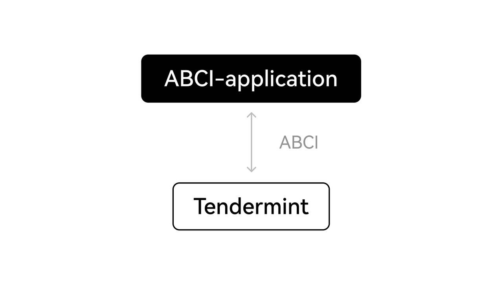

# Consensus Architecture

Learn how OKC consensus architecture leverages the Cosmos SDK Proof-of-Stake functionality, EVM compatibility and fast-finality from Tendermint Core BFT consensus.

## Cosmos SDK
OKC enables the full composability and modularity of the [Cosmos SDK](http://docs.cosmos.network/ "Cosmos SDK").

## Tendermint
More formally, Tendermint Core performs Byzantine Fault Tolerant (BFT) State Machine Replication (SMR) for arbitrary deterministic, finite state machines.
Tendermint consists of two chief technical components: a blockchain consensus engine and a generic application interface. The consensus engine, called Tendermint Core, ensures that the same transactions are recorded on every machine in the same order. The application interface, called the Application BlockChain Interface (ABCI), enables the transactions to be processed in any programming language. 

Unlike other blockchain and consensus solutions, which come pre-packaged with built-in state machines (like a fancy key-value store, or a quirky scripting language), developers can use Tendermint for BFT state machine replication of applications written in whatever programming language and development environment is right for them.
## Byzantine-Fault-Tolerance (BFT)
BFT can only tolerate up to a 1/3 of failures, those failures can include arbitrary behaviour, including hacking and malicious attacks. Tendermint never forks in the presence of asynchrony if less than 1/3 of  processes are faulty. This property is what makes Tendermint a BFT-based PoS protocol, in which it strictly prefers safety over  liveness. Tendermint blockchain will halt momentarily until a supermajority, i.e. more than 2/3, of the validator set comes to consensus.
Unlike Nakamoto consensus where it’s subject to 51% attack (meaning that 51% of the actors acting maliciously could attack and alter the blockchain), Tendermint is more resistant as it is subject to a 66% attack.

>💡If you want to understand in more detail how this concept works, check this link: [Delegated Byzantine Fault Tolerance (dBFT) - CryptoGraphics](https://cryptographics.info/cryptographics/blockchain/consensus-mechanisms/delegated-byzantine-fault-tolerance-dbft/ "Delegated Byzantine Fault Tolerance (dBFT) - CryptoGraphics") 

### Consensus
The 3 main stakeholders that play the major roles in OKC consensus are:
1. [Validator](/okc/docs/dev/core-concepts/validator/validators-overview.html#introduction "Validator"): All nodes participating in consensus verification. 
2. Proposer: The block producer node selected in the Validator.
3. [Delegator](/okc/docs/dev/core-concepts/delegator/delegators-overview.html "Delegator"): OKT holders who delegate votes on nodes based on their reputation, stability, security and infrastructure.

#### Delegators: Determining Validators by Delegating Voting Power
Prior to defining the next block via BFT consensus, Delegators come in to determine the effective validators (the top 21 validators) to propose the next block, based on their reputation, stability, security and infrastructure. The amount of the native chain token owned and delegated to a validator represents its voting power, giving them the opportunity to be a new block proposer more often. Decentralization here is “measured” by the voting power distribution amongst the validators and not the number of validators.

#### BFT Consensus - Propose and Commiting New Block
Tendermint rotates through the validator set, i.e. block proposers, in a weighted round-robin fashion. The more stake, i.e. voting power, that a validator has delegated to them, the more weight that they have, and the proportionally more times they will be elected as leaders. To illustrate, if one validator has the same amount of voting power as another validator, they will both be elected by protocol an equal number of times.

Consensus process goes through these 5 steps: NewHeigh -> Propose -> Pre-vote -> Pre-commit -> Commit

The 2 steps **Newheigh** and **Commit** at the beginning and end are called special steps, while the 3 steps (Propose, Pre-vote and Pre-commit) in the middle of the cylce are called a **Round**, which is the consensus stage and the core principal of the algorthm. 

Participants in the protocol are called **validators**; they take turns proposing blocks of transactions and voting on them. Blocks are committed in a chain, with one block at each **height**. A block may fail to be committed, in which case the protocol moves to the next **round**, and a new validator gets to propose a block for that height. Two stages of voting are required to successfully commit a block; we call them **pre-vote** and **pre-commit**. A block is committed when more than 2/3 of validators pre-commit for the same block in the same round.

1. **Propose** - a validator is chosen in a round-robin format. The validator will send a proposal for the new block to be added to the blockchain with their signature to the other validators.
2. **Pre-vote** - All the validators will receive the proposal, decide whether to accept the block and send a message to all the validators.
3. **Pre-commit** -  Each validator will receive a vote from every other validator. If at least 2/3 of the validators accept, they will send a pre-commit acknowledgment. A new round will begin for the same blockchain height if there is not a majority.

When more than two-thirds of the validators pre-vote for the same block, we call that a **polka**. Every pre-commit must be justified by a polka in the same round.
Once a validator precommits a block, it is locked on that block. Then, 
1. it must prevote for the block it is locked on 
2. it can only unlock, and precommit to a new block, if there is a polka for that block in a later round

This consensus ensures that all nodes maintain the same blockchain, i.e. the same list of blocks containing the past transactions and that all nodes could propose a block through Proposer rotation.

### Application Blockchain Interface (ABCI)
The [ABCI](https://github.com/tendermint/abci "ABCI") is the server-client architectural API that defines communication between Tendermint Core and the hosted application. The Core serves as the client and sends requests using socket connections; the application can send one of three response messages:

1. **DeliverTx** - The message is accompanied by each transaction. An application needs to validate it and then update the state. 
2. **CheckTx** - Similar to DeliverTx, but is used primarily for validating transactions. The Core’s mempool checks validity and only disseminates valid transactions. 
3. **Commit** - The application calculates the Merkle root hash of the application state, which will be placed in the next block header.

Developers can write their blockchain in any language using the endpoints defined by the ABCI.

OKC is such an example of an ABCI application replacing Ethereum (PoW) via Tendermint consensus engine. Another example of a cryptocurrency application built on Tendermint is the Cosmos network. Tendermint is able to decompose the blockchain design by offering a very simple API (ie. the ABCI) between the application process and consensus process.

### EVM module
OKC enables EVM compatibility by implementing various components that together support all the EVM state transitions while ensuring the same developer experience as Ethereum:
- Ethereum transaction format as a Cosmos SDK 'Tx' and 'Msg' interface
- 'secp256k1' curve for the Cosmos Keyring
- 'StateDB' interface for state updates and queries
- [JSON-RPC](/okc/docs/dev/api/okc-api/grpc-api.html "JSON-RPC") client for interacting with the EVM
