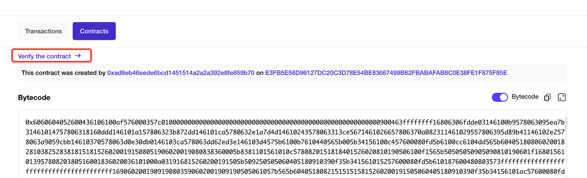

# Verify Contracts

- Go to your contact page and click on “Verify the contract”

- Select Single file and compiler version

- Copy your contract code below and check “Optimization” if it’s enabled

That’s it! You have verified your proxy contract.

