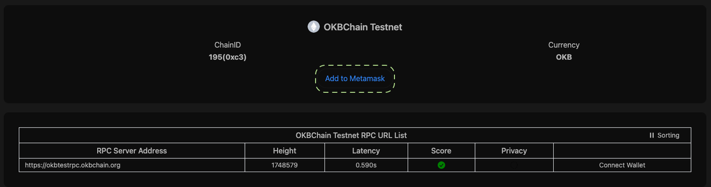
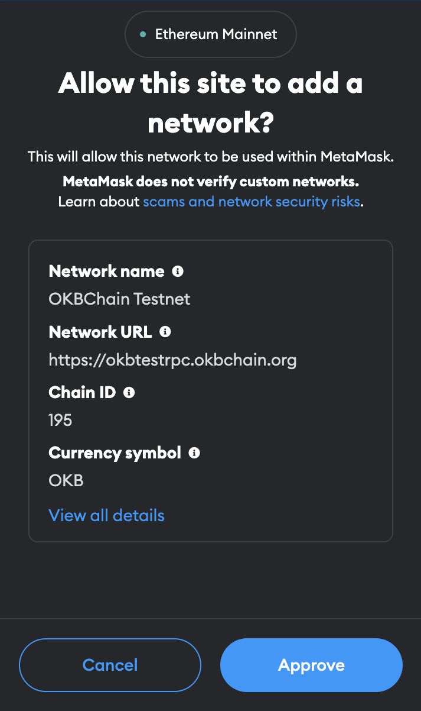
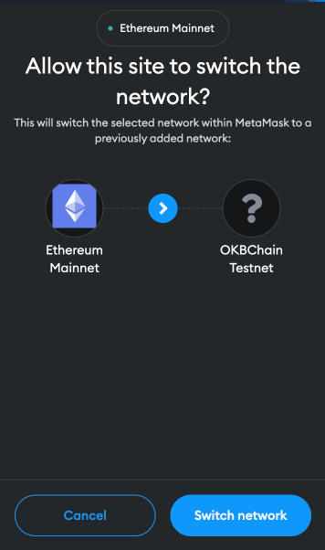
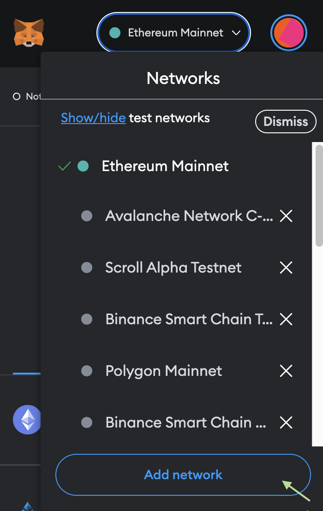
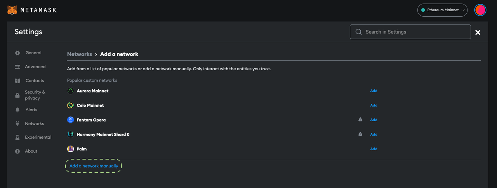
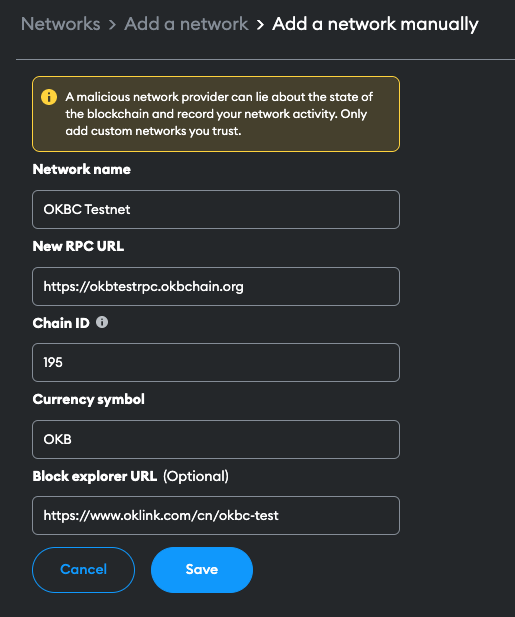

# Add OKBC to MetaMask
To perform transactions on OKBC with your MetaMask wallet, you will need to configure OKBC testnet and mainnet URLs on Metamask.

## Add OKBC via Chainlist
The easiest way to add OKBC Testnet & Mainnet is through Chainlist.

1. Go to https://chainlist.org/chain/195 and click on **Add to MetaMask** button, if you have not yet connected your wallet to Chainlist, click **Connect Walle**t first.

2. A MetaMask request window will popup. Click on **Approve** to proceed

3. Click on **Switch network** to use OKBC Testnet!

## Add OKBC by Manual Input
You can also input the following network info to add OKBC manually.
### OKBC Testnet

| Properties  | Network Details  |
| :------------ | :------------ |
| Network Name  | OKB Chain Testnet  |
| RPC URL  | https://okbtestrpc.okbchain.org/  |
| Chain ID  | 195 (okbchaintest-195)  |
| Symbol  | OKB  |
| Block Explorer  | https://www.oklink.com/cn/okbc-test  |

### OKBC Mainnet
Mainnet network info will be updated after OKB Chain is live on Mainnet.

#### Steps to add OKBC
1. Click on network dropdown button, and click on **Add network**

2. Click on **Add a network manually**

3. Input the OKBC network info, and click **Save**.
