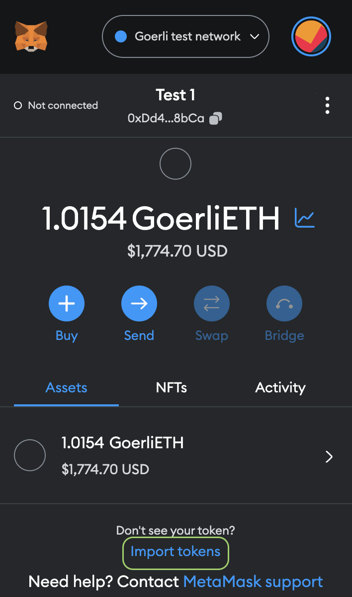
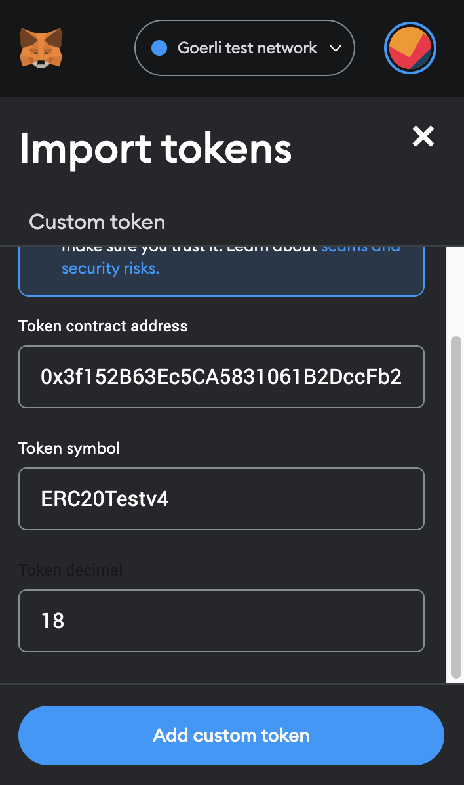
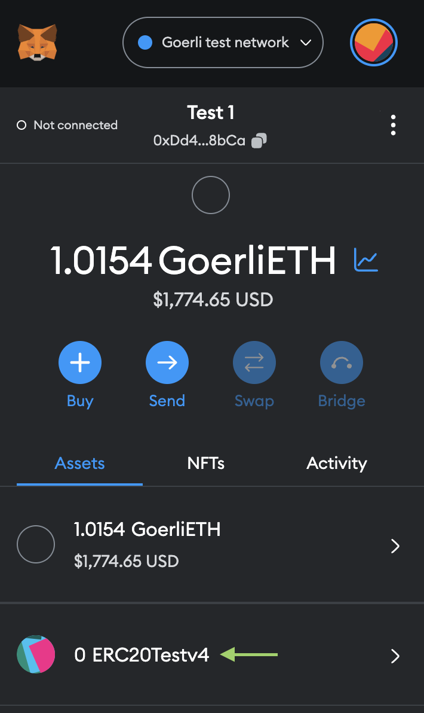

# Configure Custom Tokens
This page provides a step-by-step guide on how to configure or add custom tokens to your MetaMask wallet.
By following this process, you can add any custom tokens to any network supported by MetaMask. To make it easier, you can refer to this [table](https://wiki.polygon.technology/docs/develop/metamask/custom-tokens#tokens-and-contract-adresses "table") for a few examples of test tokens along with their corresponding contract addresses.

## Adding a custom token to your MetaMask account
To start with, choose the network for the new token on your MetaMask's home screen. Then click on **Import Tokens**

It will then navigate you to a new screen. On the Import Tokens screen, copy-paste an address in the Token Address field.

The other fields will auto-populate. You may need to edit the token symbol if it's exceeding 11 words.
Click on **Add Custom Tokens** and then click on **Import Tokens**. The `TEST` token should now be displayed on your account on Metamask.

## Tokens and Contract Adresses
|Token|Network|Contract Address|
|:----|:----|:----|
|ERC20-TESTV4|Goerli|0x3f152B63Ec5CA5831061B2DccFb29a874C317502|
|ERC721-TESTV4|Goerli|0xfA08B72137eF907dEB3F202a60EfBc610D2f224b|

