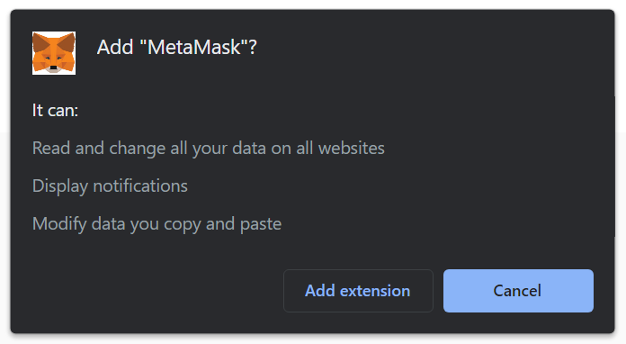

# Overview
MetaMask is a crypto wallet that you can use on your web browser or mobile devices to interact with the Ethereum network and other EVM compatible blockchains. With MetaMask, you can run Ethereum DApps without having to run a full Ethereum node.

>**Caution**
It is important to backup your **Secret Recovery Phrase** as it is the only way to recover your MetaMask accounts if your device is lost, stolen, or experiences data corruption. Check more [Basic Safety and Security Tips for MetaMask](https://support.metamask.io/hc/en-us/articles/360015489591-Basic-Safety-and-Security-Tips-for-MetaMask "Basic Safety and Security Tips for MetaMask").

## Guide to create a MetaMask wallet for OKB Chain
If you are wondering how to create a new cryptocurrency wallet, consider creating one by installing the MetaMask extension.

### Step 1. Install MetaMask on your browser
To create a new wallet with MetaMask, you need to install the extension first. You can install MetaMask for [Chrome](https://chrome.google.com/webstore/detail/metamask/nkbihfbeogaeaoehlefnkodbefgpgknn "Chrome"), [Firefox](https://addons.mozilla.org/en-US/firefox/addon/ether-metamask/ "Firefox") and Brave browsers.
1. Open https://metamask.io or search for “Metamask extension” using your favorite search engine.
> **NOTE**
In this tutorial, we will be using Google Chrome as an example, but the workflow is the same for all browsers.

2. Click **Download** to install MetaMask as a Google Chrome extension.
3. Click **Add to Chrome**.

4. Click** Add Extension**.

Voilà! You have successfully installed MetaMask extension!

### Step 2. Create an account
The next step is to create an account.
1. When the download is finished, you will be able to either **restore a wallet** with a Secret Recovery Phrase or **create a new account**, by creating a new wallet and generating a new Secret Recovery Phrase.

2. You will be asked to create a new password. **Create** a strong password and click Create.

3. MetaMask will then provide some information about the Secret Recovery Phrase and on the next page you will see your phrase.

4. Write the 12-word phrase down on a piece of paper in the same order presented.
> **Caution**
Read carefully Metamask's instructions. Write this phrase on a piece of paper and store in a secure location. If you want even more security, write it down on multiple pieces of paper and store each in 2–3 different locations. You can even memorize this phrase.

5. Verify your secret phrase by selecting the previously generated phrase. When done, click Confirm.

By "solving this puzzle" you are confirming that you know your secret phrase.
**Congratulations**! You have successfully created your MetaMask account. A new Ethereum wallet address was automatically generated for you!