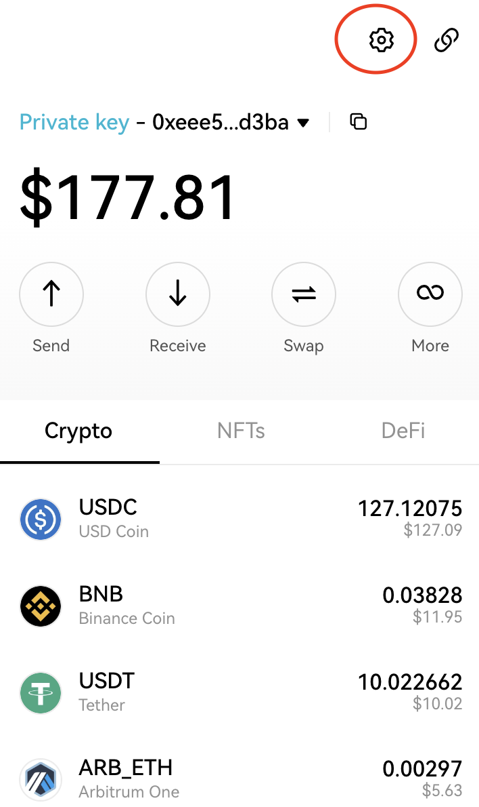
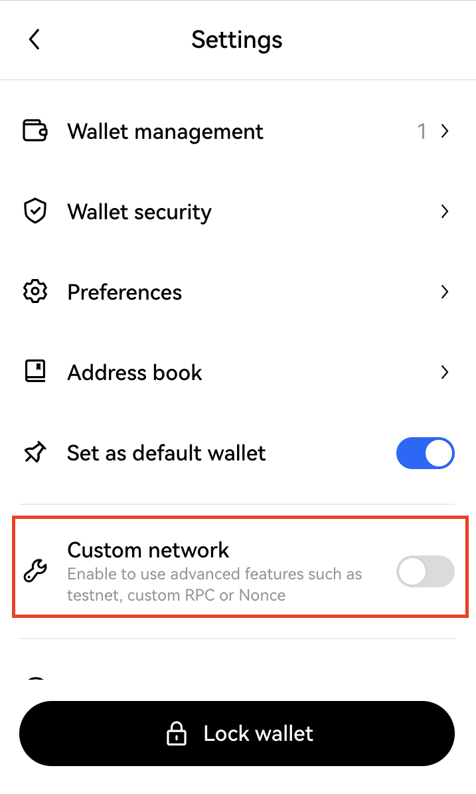
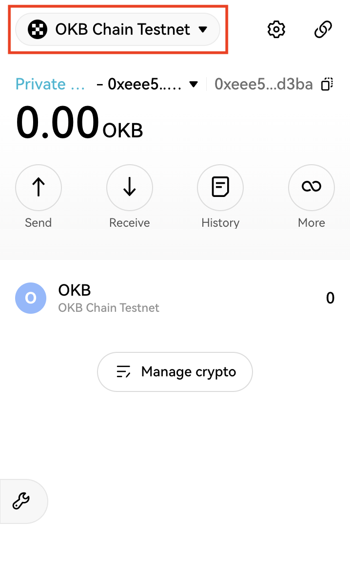
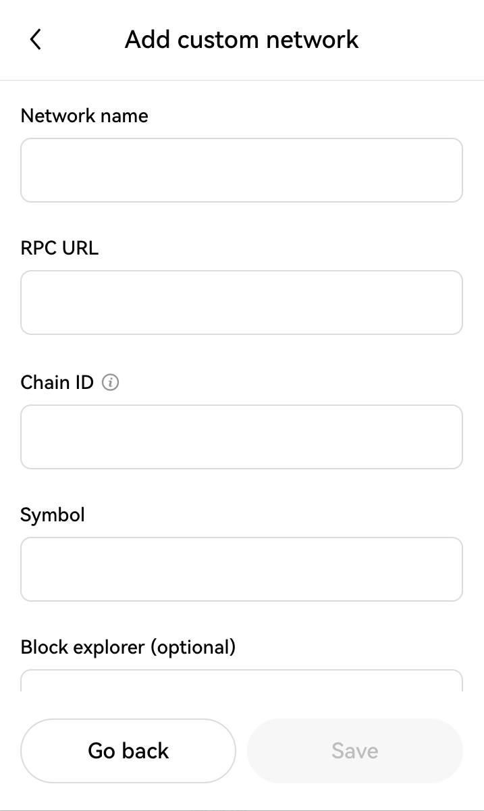

# Web3 Wallet 101
OKX Wallet is a self-custodial wallet and a developer-friendly wallet. It is the first multi-chain wallet in space, which also supports all mainstream blockchains and custom networks, allowing users to easily deploy and test contracts on testnets and custom RPCs. 

OKX Web3 wallet is suitable for DApp users who want to use it on both EVM and non-EVM chains. With multi-chain connectivity and seamless switching capabilities, users can seamlessly utilize the functionalities of different chains on DApps, providing a smooth experience.

## Installing OKX Wallet
### Mobile:
You can obtain the OKX Web3 Wallet application from the iOS App Store and Google Play Store.
* iOS: https://apps.apple.com/us/app/okx-buy-bitcoin-eth-crypto/id1327268470
* Android: https://play.google.com/store/apps/details?id=com.okinc.okex.gp&hl=en&gl=US&pli=1

### Browser Extension:
You can obtain the OKX Web3 Wallet extension through the browser extensions store.
* Chrome: https://chrome.google.com/webstore/detail/okx-wallet/mcohilncbfahbmgdjkbpemcciiolgcge
* Firefox: https://addons.mozilla.org/en-US/firefox/addon/okexwallet/

For more information, visit the official website: https://www.okx.com/download

## Custom RPC Network Configuration
There are multiple Ethereum Virtual Machine-compatible networks available for use with OKX Wallet. In order to utilize these networks in your account, you need to add them to your wallet.

RPC stands for Remote Procedure Call, which is a set of protocols that enable clients (such as OKX Wallet) to interact with the blockchain. Here are the steps to configure a custom network RPC (using OKBC Testnet as an example):

1. Click the settings button to navigate to a new page.

2. Enable Custom network.

3. Select the option for a custom network.

4. Enter the details for the custom network.

| Properties  | Network Details  |
| :------------ | :------------ |
| Network Name  | OKB Chain Testnet  |
| RPC URL  | https://okbtestrpc.okbchain.org/  |
| Chain ID  | 195 (okbchaintest-195)  |
| Symbol  | OKB  |
| Block Explorer  | https://www.oklink.com/cn/okbc-test  |

### Seamless Integration with OKX Ecosystem
In OKX Wallet, the OKBC and OKTC mainnets can be used directly without any configuration. This means that users can immediately start operating on these two mainnets without undergoing complex settings or configuration processes.

This convenience provides users with a faster and simpler user experience, allowing them to quickly participate in activities on the OKBC and OKTC mainnets. Whether it is sending transactions, trading, or engaging in other functionalities, users can begin right away and enjoy the convenience and advantages of the mainnets.

### Reference
- [OKX Wallet Documentation](https://www.okx.com/web3/build/docs/extension/introduction "OKX Wallet Documentation")