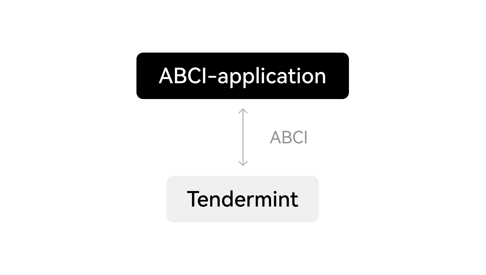

# Consensus Overview
OKB Chain consensus is based on POA + Tendermint consensus.
## POA Consensus
The decision consensus of the OKB Chain Validator Set is based on PoA and it can be switched between POA mode and DPOS mode smoothly. In POA mode, the Validator Set is determined by proposals made by validators that are already in the blockchain network. The proposals support adding or removing validators from the network.

In DPOS mode, the Validator Set is determined by voting-power, and the top n validators have the right to propose a new block. The POA mode and the DPOS mode are differentiated by their methods of adding or removing a validator.
1. Default mode is PoA after chain starts, you can define the initial Validator Set through the genesis.json file
2. Create proposal to control the Validator Set, and the Validator can be created and kicked out through the proposal, which requires 2/3 of the super nodes in the network to vote and pass
3. The transaction fee of the dividend module is evenly distributed to the block signers

## Tendermint
OKB Chain leverages Tendermint Core Byzantine Fault Tolerant (BFT) consensus for proposing block. Tendermint consists of two chief technical components: a blockchain consensus engine and a generic application interface. The consensus engine, called Tendermint Core, ensures that the same transactions are recorded on every machine in the same order. The application interface, called the Application BlockChain Interface (ABCI), enables the transactions to be processed in any programming language.

Unlike other blockchain and consensus solutions, which come pre-packaged with built-in state machines (like a fancy key-value store, or a quirky scripting language), developers can use Tendermint for BFT state machine replication of applications written in whatever programming language and development environment is right for them.
## Byzantine Fault Tolerance (BFT)
BFT can only tolerate up to a 1/3 of failures, those failures can include arbitrary behaviour, including hacking and malicious attacks. Tendermint never forks in the presence of asynchrony if less than 1/3 of processes are faulty. This property is what makes Tendermint a BFT-based PoS protocol, in which it strictly prefers safety over liveness. Tendermint blockchain will halt momentarily until a supermajority, i.e. more than 2/3, of the validator set comes to consensus. Unlike Nakamoto consensus where it’s subject to 51% attack (meaning that 51% of the actors acting maliciously could attack and alter the blockchain), Tendermint is more resistant as it is subject to a 66% attack.
>💡If you want to understand in more detail how this concept works, check this link: [Delegated Byzantine Fault Tolerance (dBFT) - Coin Rivet](https://coinrivet.com/delegated-byzantine-fault-tolerance-dbft-explained/ "Delegated Byzantine Fault Tolerance (dBFT) - Coin Rivet")

### BFT Consensus - Propose and Committing New Block
BFT Consensus process goes through these 5 steps: NewHeigh -> Propose -> Pre-vote -> Pre-commit -> Commit

The 2 steps **Newheigh** and **Commit** at the beginning and end are called special steps, while the 3 steps (Propose, Pre-vote and Pre-commit) in the middle of the cycle are called a **Round**, which is the consensus stage and the core principal of the algorithm.
Participants in the protocol are called **validators**; they take turns proposing blocks of transactions and voting on them. Blocks are committed in a chain, with one block at each **height**. A block may fail to be committed, in which case the protocol moves to the next round, and a new validator gets to propose a block for that height. Two stages of voting are required to successfully commit a block; we call them **pre-vote** and **pre-commit**. A block is committed when more than 2/3 of validators pre-commit for the same block in the same round.

1. **Propose** - a validator is chosen in a round-robin format. The validator will send a proposal for the new block to be added to the blockchain with their signature to the other validators.
2. **Pre-vote** - All the validators will receive the proposal, decide whether to accept the block and send a message to all the validators.
3. P**re-commit** - Each validator will receive a vote from every other validator. If at least 2/3 of the validators accept, they will send a pre-commit acknowledgment. A new round will begin for the same blockchain height if there is not a majority.

Validators may encounter situations where they are unable to commit a block, such as when the current proposer is offline or the network is slow. In such cases, Tendermint allows validators to skip a block. They wait for a short period of time to receive a complete proposal block from the proposer before voting to move to the next round. While this approach relies on a timeout, the rest of the Tendermint protocol is asynchronous. Progress is made only after hearing from more than 2/3 of the validator set. Additionally, Tendermint simplifies the block-commitment process by using the same mechanism to skip to the next round.

When more than two-thirds of the validators pre-vote for the same block, we call that a polka. Every pre-commit must be justified by a polka in the same round. Once a validator precommits a block, it is locked on that block. Then,

- it must pre-vote for the block it is locked on
- it can only unlock, and precommit to a new block, if there is a polka for that block in a later round

This consensus ensures that all nodes maintain the same blockchain, i.e. the same list of blocks containing the past transactions and that all nodes could propose a block through Proposer rotation.
More details can be found [here](https://v1.cosmos.network/resources/whitepaper/ "here").

## Optimization of Consensus
OKB Chain optimized the consensus to enable Validators to propose more blocks within a short period of time.

### Problem Definition
If the proposer of a height falls behind or for other reasons, it may not have finished the last height, so it can't make the block of this height. As a result, other validators can't receive the block and it will lead to view-change, and view-change will increase the block time and reduce the TPS.

### Our Solution
The fastest validator proposes the block and sends it to the proposer. The proposer verifies the legality and signs for this block, so that at this height, the block will not be delayed by the proposer. As a result, when the proposer falls behind, a new proposer can take its place and propose the block with no view-change.
### Effect on Blockchain Performance
- Highly efficient validator proposal process
- Secured and high finality
- Faster block time & higher TPS: ~ 3s block time, and reaching 10,000 TPS 