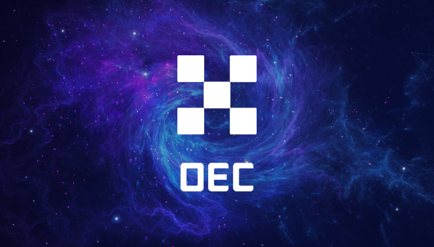

# Introduction

## What is OEC？

OEC is a set of open-source blockchain projects developed by OKEx, aiming to promote the development of large-scale commercial applications based on blockchain technology. It gives each participating node the same rights, allowing users to launch a variety of decentralized applications smoothly, issue their digital assets, create their own digital asset trading pairs, and trade freely. The utilisation of cross-chain technology principles is essential to allow those features to be used by anyone. Through the cross-chain module, the value interconnectivity and user interconnectivity, interconnectivity of blockchain can be realized simply and efficiently, so that we can co-construct the ecosystem and the value-added system.

## The OKT

Do you have OKT tokens? With OKT, you have the unique ability to contribute to the security and governance of the OEC. Delegate your OKT to one or more of the 100 validators on the OEC blockchain to earn more OKT through Proof-of-Stake. You can also vote with your OKT to influence the future of the OEC through on-chain governance proposals.

Learn more about [being a delegator](./delegators/delegators-faq.html).

## OEC Explorer

The OEC block explorer allows you to search, view and analyze OEC data—like blocks, transactions, validators as well as other key information.

* [OKlink](https://www.oklink.com)

## OEC CLI

`exchaincli` is a command-line interface that lets you interact with the OEC. `exchaincli` is the only tool that supports 100% of the OEC features, including accounts, transfers, delegation, and governance. Learn more about exchaincli with the [delegator's CLI guide](./delegators/delegators-guide-cli.html).

## Running a full-node on the OEC Testnet

In order to run a full-node on the OEC testnet, you must first [install `exchaind`](./getting-start/install-oec.html). Then, follow [the guide](./getting-start/install-oec.html).

If you would like to run a validator node, follow the [validator setup guide](./validators/validators-guide-cli.html).

## Join the Community

Have questions, comments, or ideas? Feel free to participate and to become part of the OEC community through one of the following channels.

* [OEC Validator Chat](https://t.me/joinchat/HuUCNktBLftzEY1fZPStkw)
* [OEC Developer Chat](https://t.me/okchaintech)

## Version

The version of the program relating to this documentation is: 0.10

