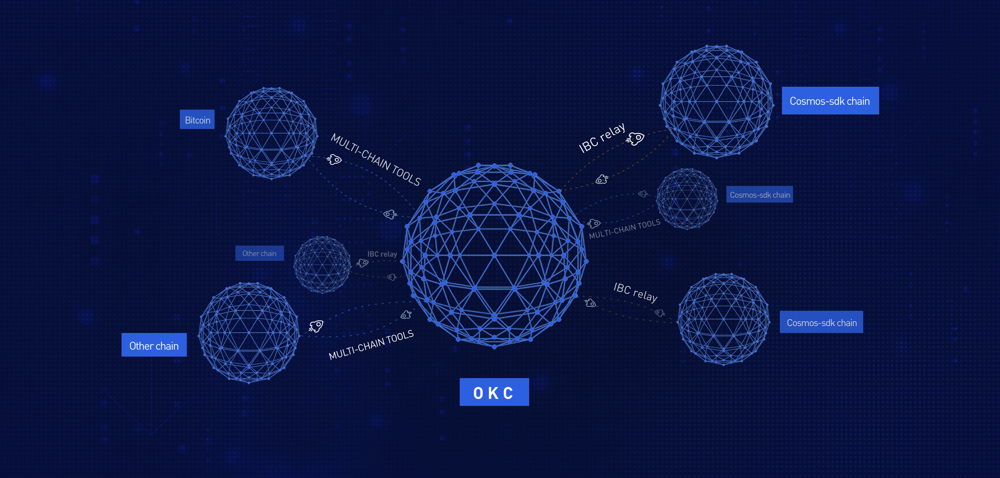

# Introduction

## What is OKChain？

OKChain is a set of open-source blockchain projects developed by OKEx, aiming to promote the landing of large-scale commercial applications based on blockchain technology. It gives each participating node the same rights, allowing users to launch a variety of decentralized applications smoothly, issue their digital assets, create their own digital asset trading pairs, and trade freely. The cross-chain technology is the key to achieving the landing. Through the cross-chain module, the value interconnectivity, user interconnectivity, and scenario application interconnectivity of blockchain can be realized simply and efficiently, so that we can co-construct the ecosystem and the value-added system.

## What is OpenDEX？

OKChain-OpenDEX, as the first project of the OKChain ecosystem, is a middleware that can freely issue DEX. With the design concept of "everyone can create DEX", it provides various basic functions needed to operate a DEX. Compared with traditional DEX, it adopts full on-chain matching and on-chain order book management to make matching information more transparent and safe; compared with Ethereum-based projects, the matching engine based on OKChain's call auction can achieve matching in seconds, which is similar to the operating experience of a centralized exchange. In addition, its unique design idea is not to build a DEX belonging to a certain stakeholder, but to provide a platform to achieve the separation of technology and operations. Just as Ethereum makes digital asset issuance easy  through smart contract technology, OKChain lowers the barrier for operating digital asset trading pairs by OpenDEX.

## The OKT

Do you have OKT tokens? With OKT, you have the superpower to contribute to the security and governance of the OKChain. Delegate your OKT to one or more of the 100 validators on the OKChain blockchain to earn more OKT through Proof-of-Stake. You can also vote with your OKT to influence the future of the OKChain through on-chain governance proposals.

Learn more about [being a delegator](./delegators/delegators-faq.html).

## OKChain Explorers

These block explorers allow you to search, view and analyze OKChain data&mdash;like blocks, transactions, validators, etc.

* [OKlink](https://www.oklink.com)

## OKChain CLI

`okchaincli` is a command-line interface that lets you interact with the OKChain. `okchaincli` is the only tool that supports 100% of the OKChain features, including accounts, transfers, delegation, and governance. Learn more about `okchaincli` with the [delegator's CLI guide](./delegators/delegators-guide-cli.html).

## Running a full-node on the OKChain Testnet

In order to run a full-node for the OKChain mainnet, you must first [install `okchaind`](./getting-start/install-okchain.html). Then, follow [the guide](./getting-start/install-okchain.html).

If you are looking to run a validator node, follow the [validator setup guide](./validators/validators-guide-cli.html).

## Join the Community

Have questions, comments, or new ideas? Participate in the OKChain community through one of the following channels.

* [OKChain Validator Chat](https://t.me/joinchat/HuUCNktBLftzEY1fZPStkw)
* [OKChain Developer Chat](https://t.me/okchaintech)

## Version

The version of the program relating to this documentation is: 0.10

