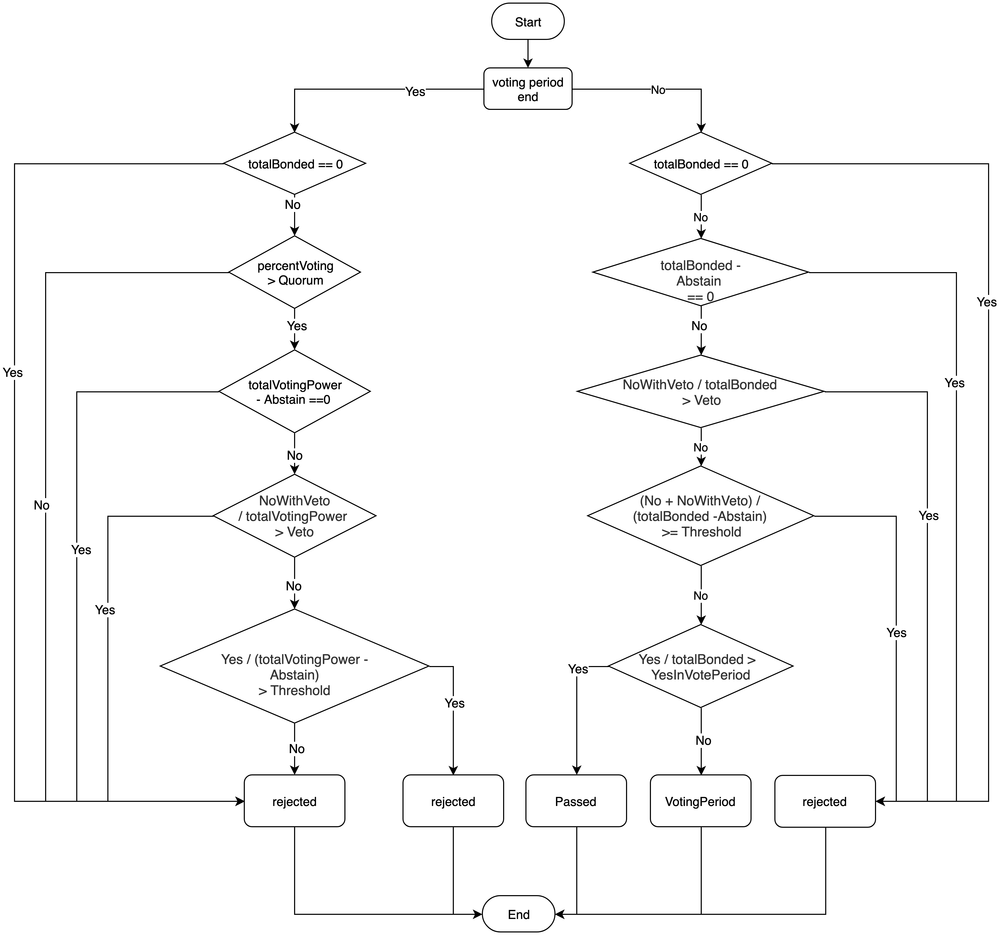

# On-chain governance

## Proposal process

The overall process of a proposal is shown below:
   
Details:  
1. The proposer should pledge OKT when initiating a proposal to prevent malicious initiation of a proposal.
2. The voting participants are bond OKT holders, except for the following two
   - a. the OKT holder bond/unbond to validator after entering vote_period
   - b. the OKT holder becomes validator after entering vote_period
3. The weight of the vote depends on the amount of OKTs in the bond.
4. To prevent duplicate voting:
   - a. the voting period is smaller than unbond_period. The minimum length of the voting period is 72h (adjustable depending on the type of proposals) .
   - b. if the delegator votes before the validator votes on his behalf, the weight of the validator’s vote does not include the weight of OKT in his bond.
   - c. if the delegator votes after the validator votes on his behalf, the weight of the voting result replaces the weight of the vote cast by the validator on behalf of the delegator.

## Proposal types
OEC offers 4 types of proposals for different purposes:
1. [Text Proposal](./governance/text.html)： to obtain network views of a topic.
2. [Parameter Proposal](./governance/parameter.html)： to change system parameters.
3. [Delist Proposal](./governance/delist.html): to delist a token pair from DEX.
4. Software Upgrade Proposal： to support the entire network upgrade.

Except for text proposals, there are four proposal stages, including initiation, deposit_period, vote_period and execution. Execution is not a text proposal’s stage.

## Proposal voting statistics
 
Meanings of variables:   
* 1. totalBonded： the sum of bonded OKT that can be used to vote on the entire network.
* 2. totalVotingPower： the sum of bonded OKT that participate in voting.
* 3. percentVoting = totalVotingPower / totalBonded.
* 4. Quorum： voting weight threshold for participating voters (0.334).
* 5. Threshold： weight threshold for the proportion of Yes votes to all non-abstained votes (0.5).
* 6. Veto： weight threshold for the proportion of NoWithVeto votes to all votes (0.334).
* 7. YesInVotePeriod： weight threshold for the proportion of Yes votes to totalBonded before the voting ends (0.667).
* 8. Yes： the sum of bonded OKT voting Yes.
* 9. No： the sum of bonded OKT voting No.
* 10. NoWithVeto： the sum of bonded OKT voting NoWithVeto.
* 11. Abstain： the sum of bonded OKT voting Abstain.

## Proposal parameters
text proposal parameters  
&emsp;&emsp;deposit period(`TextMaxDepositPeriod`): 24h   
&emsp;&emsp;minimum deposit(`TextMinDeposit`): 100okt  
&emsp;&emsp;voting period(`TextVotingPeriod`): 72h   
parameter proposal parameters   
&emsp;&emsp;deposit period(`ParamChangeMaxDepositPeriod`): 24h   
&emsp;&emsp;minimum deposit(`ParamChangeMinDeposit`): 100okt  
&emsp;&emsp;voting period(`ParamChangeVotingPeriod`): 72h   
&emsp;&emsp;maximum block height(`ParamChangeMaxBlockHeight`)：100000
delist proposal parameters   
&emsp;&emsp;deposit period(`ParamChangeMaxDepositPeriod`): 24h   
&emsp;&emsp;minimum deposit(`ParamChangeMinDeposit`): 100okt  
&emsp;&emsp;voting period(`ParamChangeVotingPeriod`): 72h
software upgrade proposal parameters
&emsp;&emsp;deposit period(`AppUpgradeMaxDepositPeriod`): 24h   
&emsp;&emsp;minimum deposit(`AppUpgradeMinDeposit`): 100okt   
&emsp;&emsp;voting period(`AppUpgradeVotingPeriod`): 72h   
voting parameters of all proposals:
&emsp;&emsp;voting weight threshold for participating voters (`Quorum`)：0.334   
&emsp;&emsp;weight threshold for the proportion of Yes votes to all non-abstained votes (`Threshold`)：0.5   
&emsp;&emsp;weight threshold for the proportion of NoWithVeto votes to all votes (`Veto`)：0.334  
&emsp;&emsp;weight threshold for the proportion of Yes votes to all votes (including the voted and unvoted) before the voting ends (`YesInVotePeriod`)：0.667

Refer to [Proposal parameter](./governance/parameter.html#id1) for details.
