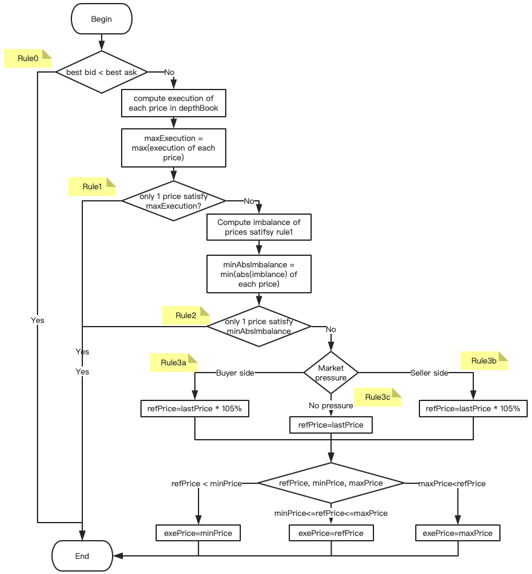

# Matching System

## Order Matching System Background

DEX’s matching system adopts a call auction mechanism. Since, in the blockchain system, orders are not continuously placed but are sorted in the sequence of block generation time, DEX, unlike most centralized exchanges, does not use a continuous auction algorithm to deal with orders. Instead, it matches orders periodically based on block generation intervals and by way of call auction.

Each block adopts the call auction approach to ensure that a trading pair only has one traded price in a block. After transactions are completed, they are executed in price and time priority. This helps greatly minimize the impact of the ordering of transactions within the block on the final matching results, increase the difficulty in front running by miners and reduce the yields of miners during front running, so as to ensure trading fairness.

## Matching process

## Benchmark price selection algorithm
* Rule 0: Best bid < best ask, no order can be executed so that there is no matching.
* Rule 1: Maximum volume principle. When a transaction is executed at the benchmark price, the maximum traded volume is reached. If multiple prices can reach the maximum volume, proceed to the next step.
* Rule 2: Minimum excess principle. Excess refers to the difference between the total cumulative number of buy orders and the total cumulative number of sell orders at the current price. The minimum excess principle means that the lowest absolute excess value is selected from the prices satisfying Rule 1. If there are multiple prices that satisfy the rule, proceed to the next step.
* Rule 3: Market pressure principle. If there are multiple prices that satisfy both Rule 1 and Rule 2 (the maximum value refers to max and the minimum value refers to min), you need to determine the positions of market pressure on potential prices. If the excess values are all positive, this means buying more and selling less and there is buying pressure; if the excess values are all negative, this means buying less and selling more and there is selling pressure; if there are both positive and negative excess values, which means there is no obvious buying or selling pressure. Determine the reference price (ref) according to the following rules. If ref is within the range of [min, max], ref is taken as the reference price; if ref is beyond the range of [min, max], the min or max closest to ref is taken as the reference price.
  - Rule 3a: If the excess values are all positive, there is buyer pressure. 105% X the previous traded price is taken as the reference price.
  - Rule 3b: If the excess values are all negative, there is seller pressure. 95% X the latest traded price is taken as the reference price.
  - Rule 3c: If there are positive and negative excess values, there is no obvious buying or selling pressure. Take the latest traded price as the reference price.

## Take benchmark prices as traded prices for matching

All bid orders are sorted in descending order of limit prices, and all ask orders are sorted in ascending order of limit prices. Orders at the same price are sorted by time (block height and tx sequence within the block) and orders at earlier time are listed first.

After the benchmark price is selected, bid and ask orders listed first are executed one by one in order of the maximum traded volumes, i.e. orders are executed in price and time priority until they are fully filled. All orders are executed at the same benchmark price.

## Example of benchmark price algorithm

The selected benchmark price is indicated by *.

Tradable volume = MIN (cumulative number of sell orders, cumulative number of buy orders)

Untraded volume (excess) = cumulative number of buy orders - cumulative number of sell orders

In the following cases, the minimum price unit is 0.1.

Example 1: Maximum volume principle (Rule 1)

| Cumulative number of sell orders | Reported number of sell orders | Reported price | Reported number of buy orders | Cumulative number of buy orders | Tradable volume | Untraded volume |
|------------|------------|----------|------------|------------|----------|----------|
| 3          |            | 1.0      | 2          | 2          | 2        |          |
| 3          | 2          | 0.8*     | 2          | 4          | 3        |          |
| 1          | 1          | 0.7      |            | 4          | 1        |          |

Example 2: Minimum excess principle (Rule 2)

| Cumulative number of sell orders | Reported number of sell orders | Reported price | Reported number of buy orders | Cumulative number of buy orders | Tradable volume | Untraded volume |
|------------|------------|----------|------------|------------|----------|----------|
| 12         |            | 1.2      | 2          | 2          | 2        |          |
| 12         |            | 1.1      | 2          | 4          | 4        |          |
| 12         |            | 0.9      | 5          | 9          | 9        | -3       |
| 12         | 2          | 0.8      |            | 9          | 9        | -3       |
| 10         | 5          | 0.7*     |            | 9          | 9        | -1       |
| 5          |            | 0.6      | 2          | 11         | 5        |          |
| 5          | 5          | 0.5      |            | 11         | 5        |          |

Example 3: Market pressure principle. Buying pressure (Rule 3a). The latest traded price is 10.0. The reference price is 10.0 * 1.05 = 10.5. The benchmark price is 10.4.

| Cumulative number of sell orders | Reported number of sell orders | Reported price | Reported number of buy orders | Cumulative number of buy orders | Tradable volume | Untraded volume |
|------------|------------|----------|------------|------------|----------|----------|
| 5          |            | 10.4*    | 6          | 6          | 5        | 1        |
| 5          | 3          | 10.3     |            | 6          | 5        | 1        |
| 2          | 2          | 9.9      |            | 6          | 2        |          |

Example 4: Market pressure principle. Buying pressure (Rule 3a). The latest traded price is 10.0. The reference price is 10.0 * 1.05 = 10.5. The benchmark price is 10.5.

| Cumulative number of sell orders | Reported number of sell orders | Reported price | Reported number of buy orders | Cumulative number of buy orders | Tradable volume | Untraded volume |
|------------|------------|----------|------------|------------|----------|----------|
| 5          |            | 10.8     | 6          | 6          | 5        | 1        |
| 5          | 3          | 10.3     |            | 6          | 5        | 1        |
| 2          | 2          | 9.9      |            | 6          | 2        |          |

Example 5: Market pressure principle. Selling pressure (Rule 3b). The latest traded price is 10.0. The reference price is 10.0 * 0.95 = 9.5. The benchmark price is 9.6.

| Cumulative number of sell orders | Reported number of sell orders | Reported price | Reported number of buy orders | Cumulative number of buy orders | Tradable volume | Untraded volume |
|------------|------------|----------|------------|------------|----------|----------|
| 6          |            | 10.1     | 2          | 2          | 2        |          |
| 6          |            | 9.7      | 3          | 5          | 5        | -1       |
| 6          | 6          | 9.6*     |            | 5          | 5        | -1       |

Example 6: Market pressure principle. Selling pressure (Rule 3b). The latest traded price is 10.0. The reference price is 10.0 * 0.95 = 9.5. The benchmark price is 9.5.

| Cumulative number of sell orders | Reported number of sell orders | Reported price | Reported number of buy orders | Cumulative number of buy orders | Tradable volume | Untraded volume |
|------------|------------|----------|------------|------------|----------|----------|
| 6          |            | 10.1     | 2          | 2          | 2        |          |
| 6          |            | 9.7      | 3          | 5          | 5        | -1       |
| 6          | 6          | 9.4      |            | 5          | 5        | -1       |

Example 7: Market pressure principle. There is no obvious buying or selling pressure (Rule 3c). The latest traded price is 10.0. The reference price is 10.0. The benchmark price is 10.0.

| Cumulative number of sell orders | Reported number of sell orders | Reported price | Reported number of buy orders | Cumulative number of buy orders | Tradable volume | Untraded volume |
|------------|------------|----------|------------|------------|----------|----------|
| 5          |            | 10.2     | 2          | 2          | 5        | -3       |
| 5          | 3          | 10.0*    |            | 2          | 5        | -3       |
| 2          |            | 9.8      | 3          | 5          | 5        | 3        |
| 2          | 2          | 9.4      |            | 5          | 5        | 3        |

Example 8: Market pressure principle. There is no obvious buying or selling pressure (Rule 3c). The latest traded price is 10.5. The reference price is 10.5. The benchmark price is 10.2.

| Cumulative number of sell orders | Reported number of sell orders | Reported price | Reported number of buy orders | Cumulative number of buy orders | Tradable volume | Untraded volume |
|------------|------------|----------|------------|------------|----------|----------|
| 5          |            | 10.2*    | 2          | 2          | 5        | -3       |
| 5          | 3          | 10.0     |            | 2          | 5        | -3       |
| 2          |            | 9.8      | 3          | 5          | 5        | 3        |
| 2          | 2          | 9.4      |            | 5          | 5        | 3        |

## Matchmaking priority mechanism

Within the OKC network, there will be much more orders with different products flooding into one block since OKT holders have the ability to list their own token pair on the DEX.

The CPU resource of the node can’t afford the full matching for in-block orders during a block time.

The matchmaking priority mechanism confirms the order of product matching by matchmaking deposit. The owner could deposit more OKT as matchmaking reserves to his own product to gain a higher matching priority. At the same time, the owner will get all the trade fees from every matched result with his own product as reward.