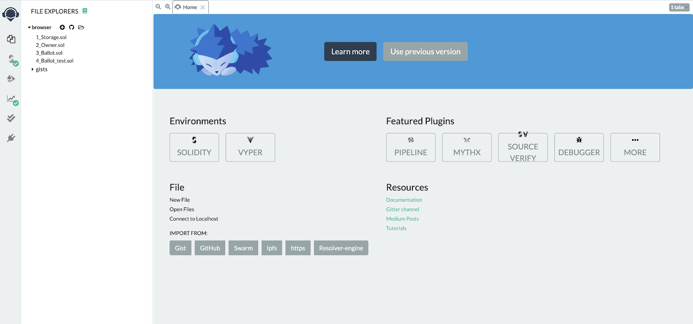
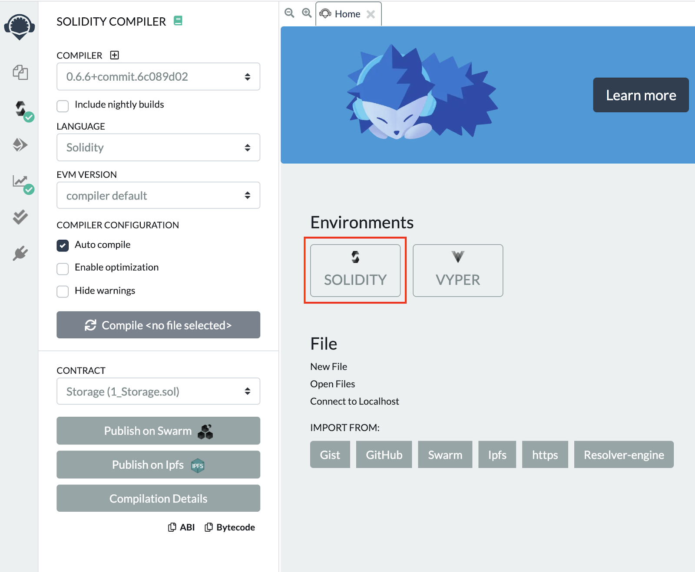
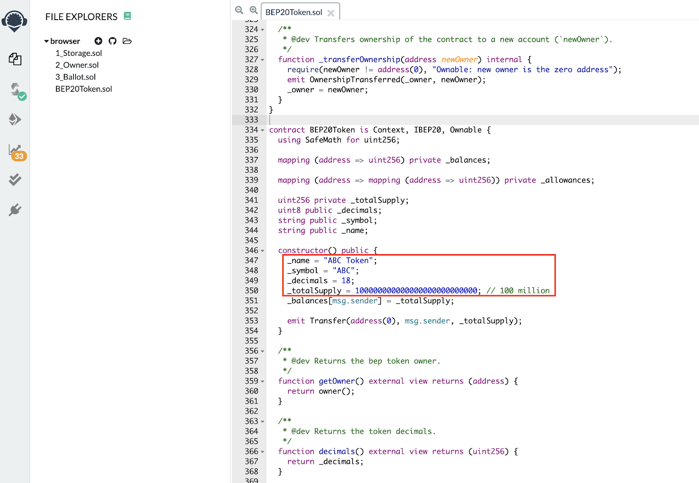
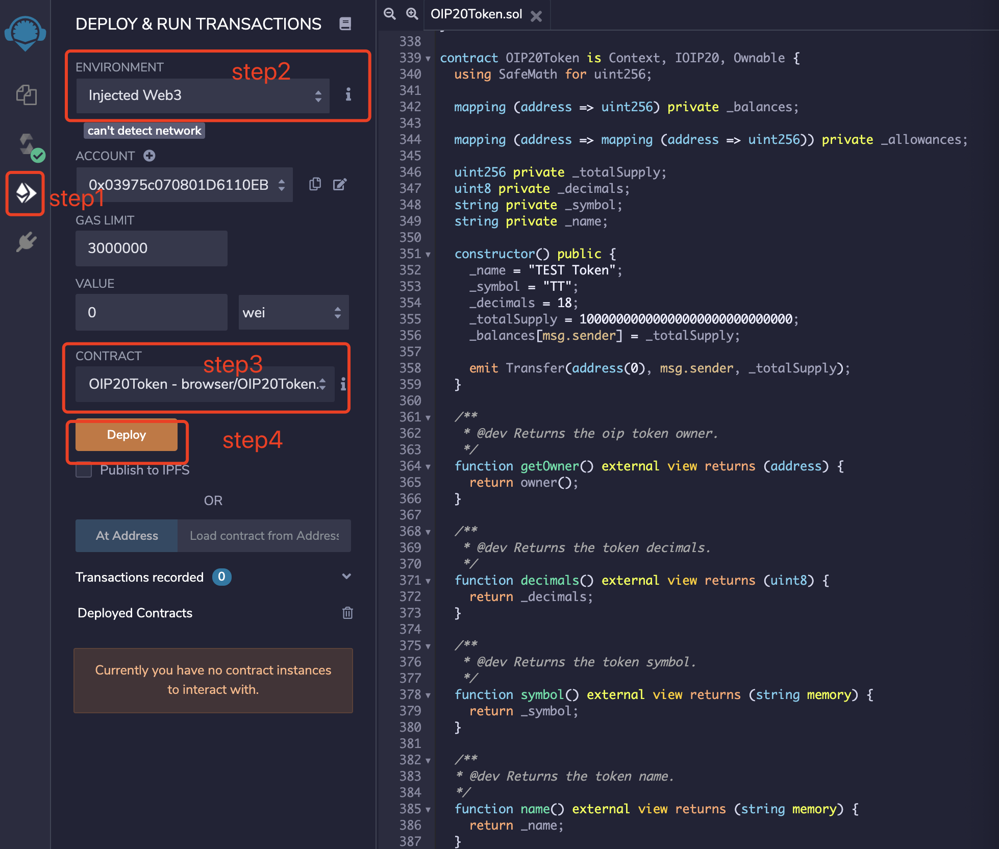

# OIP20 Tokens - Issue Token

Compile and Deploy OIP20 Contract

1.Open Remix IDE: https://remix.ethereum.org

1.Select solidity language

1.Create new contract OIP20Token.sol and copy contract code from the oip20 token template here

2.Modify “name”, “symbol”, “decimals” and “totalSupply” according to your requirements.

Compile the OIP20 token contract

a. Step1: Click button to switch to compile page

b. Step2: Select “OIP20Token” contract

c. Step3: Enable “Auto compile” and    “optimization”

d. Step4: Click “ABI” to copy the contract abi and save it.

Depoy the contract to OKEXChain

a. Step1: Click button to switch to compile button.

b. Step2: Select “Injected Web3”

c. Step3: Select “OIP20Token”

d. Step4: Client “Deploy” button and Metamask will pop up

e. Client “confirm” button to sign and broadcast transaction to OKEXChain.
