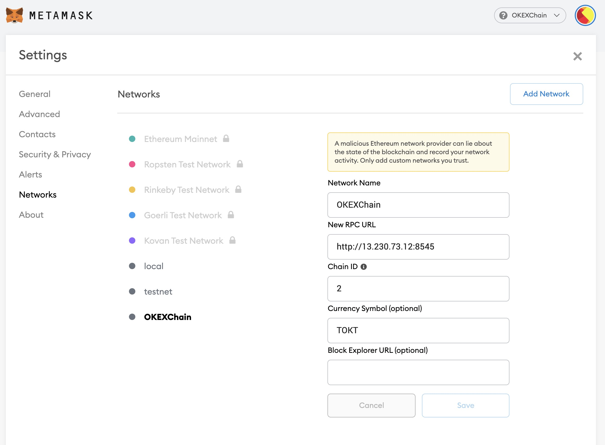
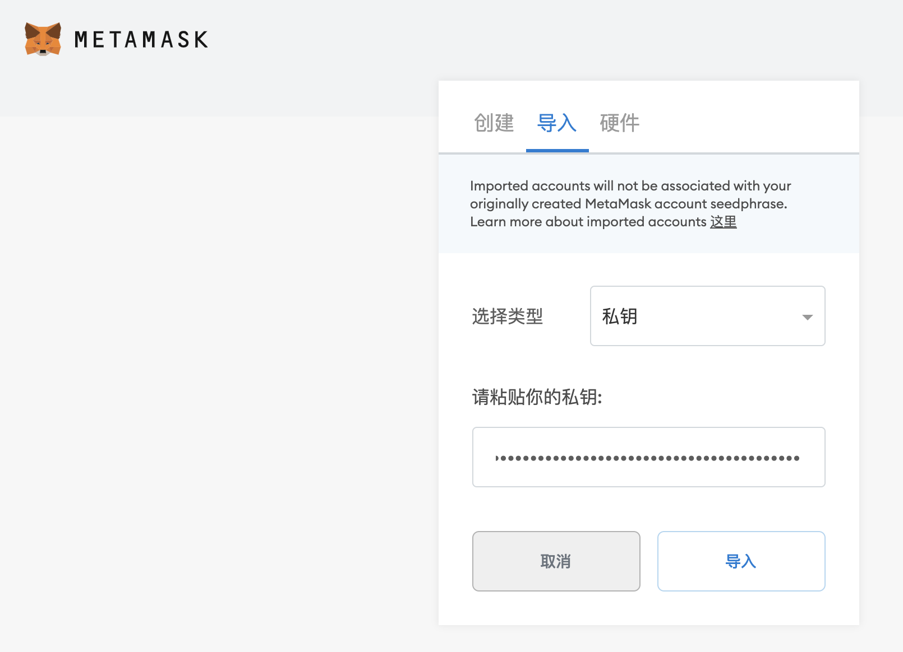
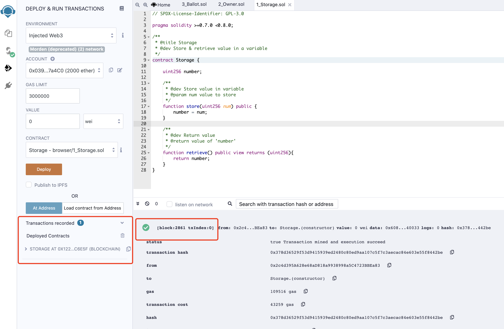

# Quick Start for Testnet
## Metamask

### 1. Config Metamask for OKExChain Testnet

- NetWork Name: OKExChain Testnet
- RPC URL: http://okexchaintest-rpc1.okexcn.com:26659 [more rpc urls](blockchainDetail/rpc.html#testnet-chain-id-okexchain-65)
- Chain ID: 65
- Currency Symbol: OKT

### 2. Create a new account or import an existing account

### 3. Get testnet token
[Faucet](https://www.okex.com/drawdex)

___
## Blockchain Browser
[OKExChain Testnet Browser](https://www.oklink.com/okexchain-test)
___

## Remix
Set up a Remix OKExChain Testnet development environment.    
Remix is an in-browser IDE for Solidity smart contracts. In this guide, we will learn how to deploy a contract to a running OKExChain Testnet through Remix and interact with it.   
### 1. Connect OKExChain account to Remix
Go to [Remix](http://remix.ethereum.org/). There are some contracts in the File Explorer. Select any of these contracts. In this example, we use `Storage.sol`. On the left-most bar, select the Solidity Compiler and compile the contract.

Next, select the `Deploy and Run` option. Select `injected web3` as the environment. This will open a metamask popup for you to confirm connecting your Metamask to Remix. Hit confirm.

You should see your account show up in the left-hand panel.

### 2. Deploy and Interact
Now that your account is connected, you are able to deploy the contract. Press the Deploy button. A metamask pop-up will appear asking you to confirm. Confirm the transaction   

Once the contract has been successfully deployed, you will see it show up in the Deployed Contracts section in the left-hand side, as well as a green check in the Remix console showing the transaction details.   

Now, you are able to interact with the contract through Remix. For Storage.sol, input 1000 and click `store`. This will open a Metamask pop-up asking you to confirm. Confirm the transaction. Then, click `retrieve` to get the number, which should be 1000.

