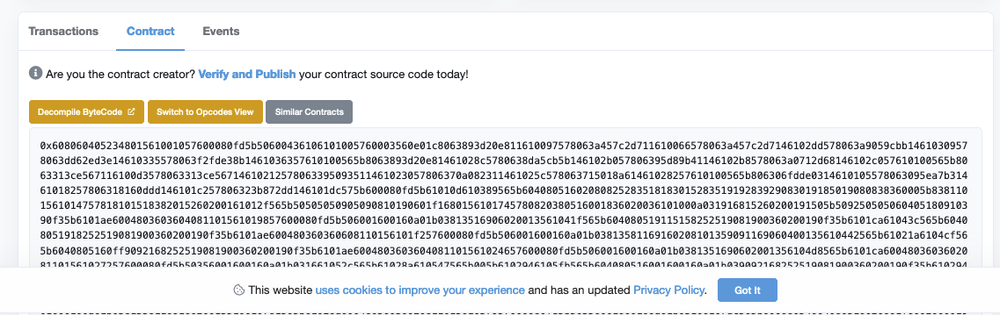
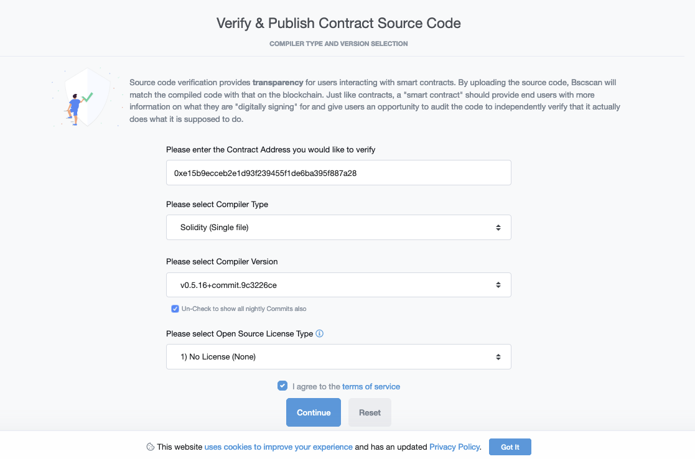
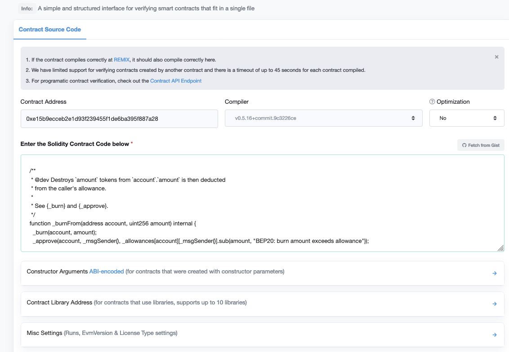

#How to Verify Your Contract on oklink.com
###Step 1: Deploy your contract on OKEXChain
###Step 2: Go to [OKEXChain Explorer](https://www.oklink.com/) or [Testnet Explorer](https://www.oklink.com/okexchain-test)
Click on "Verify and Publish"

###Step 3: Fill in the correct information of your contract

- Contract Address
- Compiler Type you chose in Remix or other complier
- Select Open Source License Type
###Step 4: Enter the Solidity Contract Code

You need to select "Yes" for Optimization, if that's enabled.

Contructor arguement is optional. If your contract do have one, you can go to this page to generate the encoded ABI json.

> The default OIP20 contract template does not have a constructor method

Click on "Verify and Publish" to finish this process. Now you are all set!