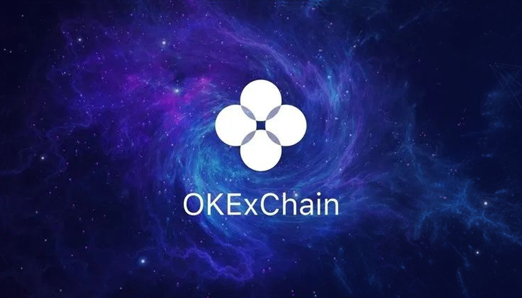
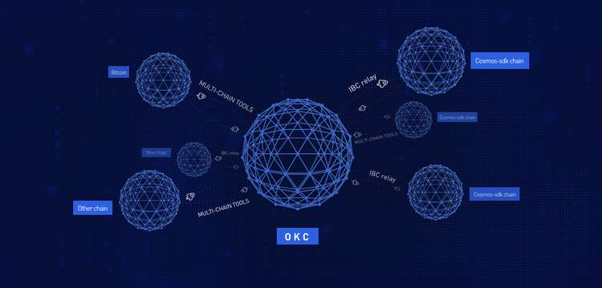

.. _index:
.. okexchain-docs documentation master file, created by
   sphinx-quickstart on Tue Jan  7 11:23:39 2020.
   You can adapt this file completely to your liking, but it should at least
   contain the root `toctree` directive.

   Welcome to the OKExChain
Introduction
============

What is OKExChain？
-----------------

OKExChain is a set of open-source blockchain projects developed by OKEx,
aiming to promote the development of large-scale commercial applications
based on blockchain technology. It gives each participating node the
same rights, allowing users to launch a variety of decentralized applications
smoothly, issue their digital assets, create their own digital asset trading
pairs, and trade freely. The utilisation of cross-chain technology principles
is essential to allow those features to be used by anyone. Through the
cross-chain module, the value interconnectivity and user interconnectivity,
interconnectivity of blockchain can be realized simply and efficiently,
so that we can co-construct the ecosystem and the value-added system.

   okexchain multi-chain
What is OKExDEX？
-----------------

OKExChain-OKExDEX, was the first project born from the OKExChain ecosystem
and is a middleware that can freely issue DEX. With the design concept of
“everyone can create DEX”, it provides various basic functions needed to operate
a DEX. Compared with traditional DEX, OKExDEX adopts a full on-chain matching and
an on-chain order book management to make matching information more transparent
and safe; compared with Ethereum-based projects, the matching engine based on
OKExChain’s call auction can achieve matching in seconds, which is similar to
the operating experience offered by centralized exchange. In addition, its unique
design idea is not to build a DEX belonging to a certain stakeholder, but to provide
a platform to achieve the separation of technology and operations. Just as Ethereum
makes digital asset issuance simple through smart contract technology, OKExChain
lowers the barrier for operating digital asset trading pairs with OKExDEX.

.. figure:: ./img/operators.jpg
   :alt: OKExDEX multi-operator relation

   OKExDEX multi-operator relation

The OKT
-------

Do you have OKT tokens? With OKT, you have the unique ability to contribute
to the security and governance of the OKExChain. Delegate your OKT to one
or more of the 100 validators on the OKExChain blockchain to earn more OKT
through Proof-of-Stake. You can also vote with your OKT to influence the
future of the OKExChain through on-chain governance proposals.

Learn more about `being a
delegator <./delegators/delegators-faq.html>`__.

OKExChain Explorer
------------------

The OKExChain block explorer allows you to search, view and analyze OKExChain
data—like blocks, transactions, validators as well as other key information

-  `OKlink <https://www.oklink.com>`__

OKExChain CLI
-------------

``exchaincli`` is a command-line interface that lets you interact with
the OKExChain. ``exchaincli`` is the only tool that supports 100% of the
OKExChain features, including accounts, transfers, delegation, and
governance. Learn more about ``exchaincli`` with the delegator’s CLI
`guide <./delegators/delegators-guide-cli.html>`__.

Running a full-node on the OKExChain Testnet
--------------------------------------------

In order to run a full-node on the OKExChain testnet, you must first
`install exchaind <./getting-start/install-okexchain.html>`__. Then,
follow `the guide <./getting-start/install-okexchain.html>`__.

If you would like to run a validator node, follow the validator setup
`guide <./validators/validators-guide-cli.html>`__.

Join the Community
------------------

Have questions, comments, or ideas? Feel free to participate and to
become part of the OKExChain community through one of the following channels.

-  `OKExChain Validator
   Chat <https://t.me/joinchat/HuUCNktBLftzEY1fZPStkw>`__
-  `OKExChain Developer Chat <https://t.me/okchaintech>`__

Version
---------

The version of the program relating to this documentation is: 0.16.0

.. _Here: getting-start/introduction

Contents
========

.. toctree::
   :maxdepth: 3
   :caption: OKExChain

   okexchain/overview

.. toctree::
   :maxdepth: 3
   :caption: Getting Start

   getting-start/install-okexchain
   getting-start/deploy-you-own-okexchain-testnet
   getting-start/join-okexchain-testnet
   getting-start/join-okexchain-testnet-with-docker
   getting-start/join-okexchain-mainnet
   getting-start/install-faq

.. toctree::
   :maxdepth: 1
   :caption: Developers

   developers/quick-start-for-mainnet
   developers/quick-start
   developers/basics/index
   developers/tools/index
   developers/deploy/index
   developers/KIP20Tokens/index
   developers/blockchainDetail/index

.. toctree::
   :maxdepth: 3
   :caption: Swap

   swap/swap-overview
   swap/swap-guide-cli

.. toctree::
   :maxdepth: 3
   :caption: Farm

   farm/farm-overview
   farm/farm-guide-cli

.. toctree::
   :maxdepth: 3
   :caption: Swap

   swap/swap-overview
   swap/swap-guide-cli

.. toctree::
   :maxdepth: 3
   :caption: Delegators

   delegators/delegators-overview
   delegators/delegators-guide-cli
   delegators/delegators-faq

.. toctree::
   :maxdepth: 3
   :caption: Validators

   validators/validators-overview
   validators/validators-guide-cli
   validators/validators-faq

.. toctree::
   :maxdepth: 3
   :caption: DEX Traders

   dex-trades/dex-trades-overview
   dex-trades/dex-trades-guide-cli

.. toctree::
   :maxdepth: 3
   :caption: DEX Operators

   dex-operators/dex-operators-overview
   dex-operators/dex-operators-guide-cli
   dex-operators/dex-operators-faq

.. toctree::
   :maxdepth: 3
   :caption: Concepts

   concepts/general-concepts
   concepts/fee
   concepts/gov
   concepts/periodic-auction
   concepts/upgrade-concept
   concepts/sentry-nodes
   concepts/faq

.. toctree::
   :maxdepth: 3
   :caption: Resources

   resources/genesis
   resources/okexchaincli
   resources/service-providers
   resources/snapshot

.. toctree::
   :maxdepth: 3
   :caption: API

   api/http
   api/sdk

.. toctree::
   :maxdepth: 3
   :caption: Tools

   tools/monitor
   tools/command

.. toctree::
   :maxdepth: 3
   :caption: References

   link

