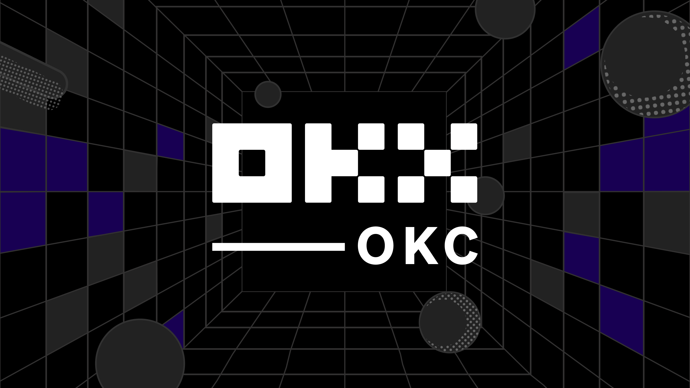
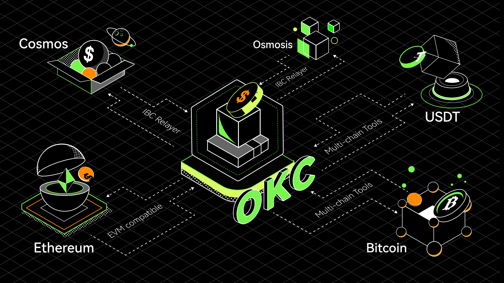

.. _index:
.. okc-docs documentation master file, created by
   sphinx-quickstart on Tue Jan  7 11:23:39 2020.
   You can adapt this file completely to your liking, but it should at least
   contain the root `toctree` directive.

   Welcome to the OKC
Introduction
============

What is OKC？
-----------------

OKC is a set of open-source blockchain projects developed by OKX,
aiming to promote the development of large-scale commercial applications
based on blockchain technology. It gives each participating node the
same rights, allowing users to launch a variety of decentralized applications
smoothly, issue their digital assets, create their own digital asset trading
pairs, and trade freely. The utilisation of cross-chain technology principles
is essential to allow those features to be used by anyone. Through the
cross-chain module, the value interconnectivity and user interconnectivity,
interconnectivity of blockchain can be realized simply and efficiently,
so that we can co-construct the ecosystem and the value-added system.

   OKC multichain framework

The OKT
-------

Do you have OKT tokens? With OKT, you have the unique ability to contribute
to the security and governance of the OKC. Delegate your OKT to one
or more of the 100 validators on the OKC blockchain to earn more OKT
through Proof-of-Stake. You can also vote with your OKT to influence the
future of the OKC through on-chain governance proposals.

Learn more about `being a
delegator <./delegators/delegators-faq.html>`__.

OKC Explorer
------------------

The OKC block explorer allows you to search, view and analyze OKC
data—like blocks, transactions, validators as well as other key information

-  `OKlink <https://www.oklink.com>`__

OKC CLI
-------------

``exchaincli`` is a command-line interface that lets you interact with
the OKC. ``exchaincli`` is the only tool that supports 100% of the
OKC features, including accounts, transfers, delegation, and
governance. Learn more about ``exchaincli`` with the delegator’s CLI
`guide <./delegators/delegators-guide-cli.html>`__.

Running a full-node on the OKC Testnet
--------------------------------------------

In order to run a full-node on the OKC testnet, you must first
`install exchaind <./getting-start/install-oec.html>`__. Then,
follow `the guide <./getting-start/install-oec.html>`__.

If you would like to run a validator node, follow the validator setup
`guide <./validators/validators-guide-cli.html>`__.

Join the Community
------------------

Have questions, comments, or ideas? Feel free to participate and to
become part of the OKC community through one of the following channels.

-  `OKC Validator
   Chat <https://t.me/joinchat/HuUCNktBLftzEY1fZPStkw>`__
-  `OKC Developer Chat <https://discord.gg/3A3U6JTkXA>`__

Version
---------

The version of the program relating to this documentation is: 0.16.0

.. _Here: getting-start/introduction

Contents
========

.. toctree::
   :maxdepth: 3
   :caption: OKC

   oec/overview

.. toctree::
   :maxdepth: 3
   :caption: Getting Start

   getting-start/install-oec
   getting-start/deploy-you-own-oec-testnet
   getting-start/join-oec-testnet
   getting-start/join-oec-testnet-with-docker
   getting-start/join-oec-mainnet
   getting-start/install-faq

.. toctree::
   :maxdepth: 1
   :caption: Developers

   developers/quick-start-for-mainnet
   developers/quick-start
   developers/basics/index
   developers/tools/index
   developers/deploy/index
   developers/KIP20Tokens/index
   developers/blockchainDetail/index

.. toctree::
   :maxdepth: 3
   :caption: Delegators

   delegators/delegators-overview
   delegators/delegators-guide-cli
   delegators/delegators-staking-cli
   delegators/delegators-faq

.. toctree::
   :maxdepth: 3
   :caption: Validators

   validators/validators-overview
   validators/validators-guide-cli
   validators/validators-faq

.. toctree::
   :maxdepth: 2
   :caption: IBC

   validators/ibc
   validators/ibc-cli

.. toctree::
   :maxdepth: 3
   :caption: Concepts

   concepts/general-concepts
   concepts/fee
   concepts/gov
   concepts/periodic-auction
   concepts/upgrade-concept
   concepts/sentry-nodes
   concepts/faq

.. toctree::
   :maxdepth: 3
   :caption: Resources

   resources/genesis
   resources/exchaincli
   resources/service-providers
   resources/snapshot

.. toctree::
   :maxdepth: 3
   :caption: API

   api/http
   api/sdk

.. toctree::
   :maxdepth: 3
   :caption: Tools

   tools/monitor
   tools/command

.. toctree::
   :maxdepth: 3
   :caption: References

   link

