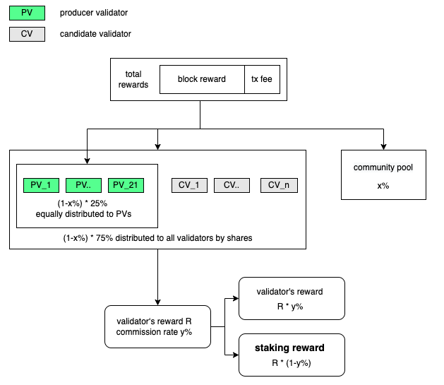
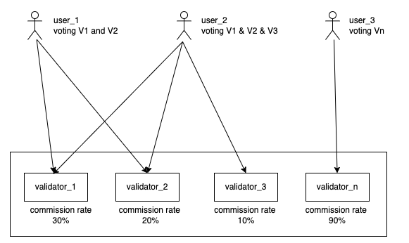
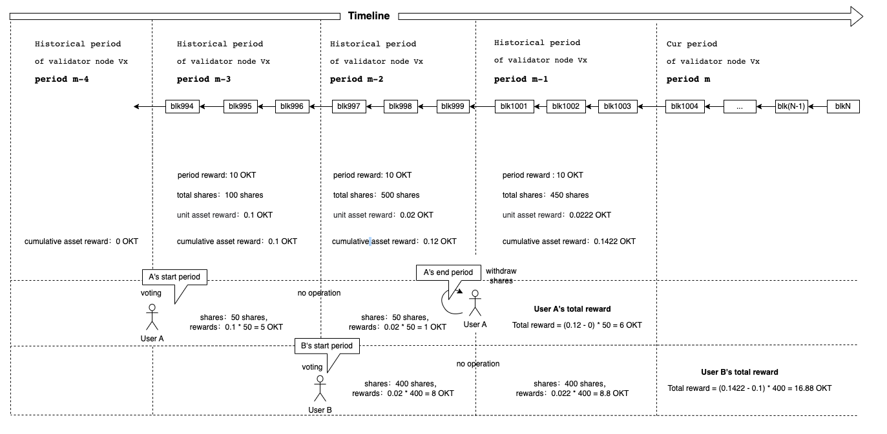

Detailed explanation of OKCs staking rewards algorithm

# Background

OKC allows users to stake OKT and vote for one or more validators, thus allowing users to receive dividend rewards on the chain. This paper explains the principles and specific guidelines of dividend rewards obtained from staking OKT.


# Example of an on-chain staking reward

OKC allows anyone that stakes a minimum of atleast 10,000 OKT the ability to operate a full node to become a registered validator. After every epoch cycle (252 blocks), OKC will calculate the weight of every validator and the Top 21 weighted nodes will become the next epoch cycle’s block producers that participate in consensus, while the others become alternative nodes. Under Tendermint’s consensus algorithm, these 21 nodes will vote to produce the new block. Every validator that participates in the maintenance of the OKC network receives a corresponding block reward.

The more vote shares a validator receives, the more weight that validator holds, therefore the bigger the reward that validator receives. In order to motivate users to vote for them, validators can set a favourable commission rate, and automatically distribute the rewards based on the ratio of voting shares. The values of commission rates range from [0,1], so if, for example, the commission rate is set to 0.6, that would mean that the validator receives 60% of the total reward, and the remaining 40% is distributed to the users based on the ratio of their voting shares.

Note: After registering as a new validator, the commission rate is defaulted at 1. The validator can set their preferred rate by initiating a transaction; for a more detailed explanation, refer to [OKC CLI staking manual](../../delegators/delegators-staking-cli.html).


Using the following website's data as an example, imagine a user holds 1000 OKT and voted for 15 different validator nodes; now imagine this user has a commission rate set at 0.6; the staking dividend reward would look like this: 

- The user would receive a staking reward from each of the 15 validators voted for; for example, Chillcrypto would provide an estimated annual reward of 13.0986997 OKT with a 1.31% APR; Unicorn would provide an estimated annual reward of 13.1002434 OKT with a 1.31% APR. 

- Because the user voted for 15 different validator nodes, the total staking reward would be a sum of the total of all 15 nodes' estimated annual rewards, which is 196.4920921 OKT with a 19.64% APR.

| name           | shares         | commissionRate | depositOKTNums (OKT) | depositOKTRewardPerYear (OKT) | APR   | top21 |
| -------------- | -------------- | -------------- | -------------------- | ----------------------------- | ----- | ----- |
| Chillcrypto    | 41898600000000 | 0.6            | 1000                 | 13.0986997                    | 1.31% | True  |
| Unique farming | 41897200000000 | 0.6            | 1000                 | 13.0988053                    | 1.31% | True  |
| Tombolo        | 41895700000000 | 0.6            | 1000                 | 13.0989268                    | 1.31% | True  |
| Defilego       | 41894100000000 | 0.6            | 1000                 | 13.0990501                    | 1.31% | True  |
| Nodeplus       | 41893900000000 | 0.6            | 1000                 | 13.0990701                    | 1.31% | True  |
| DeLab          | 41891800000000 | 0.6            | 1000                 | 13.0992307                    | 1.31% | True  |
| Hydrus         | 41889900000000 | 0.6            | 1000                 | 13.0993824                    | 1.31% | True  |
| Blockpro       | 41889500000000 | 0.6            | 1000                 | 13.0994172                    | 1.31% | True  |
| ZK capitial    | 41887000000000 | 0.6            | 1000                 | 13.099613                     | 1.31% | True  |
| Samual         | 41885600000000 | 0.6            | 1000                 | 13.0997169                    | 1.31% | True  |
| Zapzap         | 41884200000000 | 0.6            | 1000                 | 13.0998295                    | 1.31% | True  |
| Squares        | 41882900000000 | 0.6            | 1000                 | 13.0999333                    | 1.31% | True  |
| Nozash         | 41881600000000 | 0.6            | 1000                 | 13.1000349                    | 1.31% | True  |
| Collector      | 41880300000000 | 0.6            | 1000                 | 13.1001389                    | 1.31% | True  |
| Unicorn        | 41878900000000 | 0.6            | 1000                 | 13.1002434                    | 1.31% | True  |
| ChainHub       | 41870200000000 | 0.6            | 0                    | 0                             | 1.31% | True  |
| Cryptomars     | 41868000000000 | 0.6            | 0                    | 0                             | 1.31% | True  |
| Cosmostation   | 41866700000000 | 0.6            | 0                    | 0                             | 1.31% | True  |
| Nebulas NOVA   | 5529670000000  | 0.6            | 0                    | 0                             | 3.47% | True  |
| ChainUP Labs   | 5525200000000  | 0.6            | 0                    | 0                             | 3.48% | True  |
| X-DUCK         | 5341570000000  | 0.6            | 0                    | 0                             | 3.56% | True  |
| OKLive         | 5341570000000  | 0.6            | 0                    | 0                             | 0.98% | False |


# Rules of on-chain staking rewards

## Role definition

| Name      | Definition                                                   | Election Condition                                           | Quantity           |
| --------- | ------------------------------------------------------------ | ------------------------------------------------------------ | ------------------ |
| Candidate | Users who have registered Validator on the chain             | Unlimited                                                    |                    |
| Validator | Exercise the right to generate blocks and enjoy the right of on-chain governance | Top 21 nodes with the highest number of okt delegations to be the validators in the next cycle | 21                 |
| User      | A user holding okt                                           | Hold okt                                                     | Unlimited          |
| Delegator | A user who can enjoy the reward from the validator           | Vote on a node which will become a validator after the next election | Unlimited          |
| Proposer  | Pack transactions and notify other validators for verification | Generate a sequential list of proposers based on the number of pledged okt and voting okt of each validator and each validators may become a proposer | Only one each time |


## Source of staking rewards

OKCs staking rewards come from block rewards and transaction fees. OKTs issuing mechanism is similar to that of BTC, which takes a fixed total amount and periodically reduces tokens. OKT has a total of 41.69M OKT in circulation, including 10M OKT allocated by Genesis Mining; each new block corresponds to a 0.5 OKT reward, and the reward is halved every 3 years.

| Year | Block Reward | Blocks   | Volume      |
| ---- | ------------ | -------- | ----------- |
| 3    | 0.5          | 31557600 | 15778800    |
| 6    | 0.25         | 31557600 | 7889400     |
| 9    | 0.125        | 31557600 | 3944700     |
| 12   | 0.0625       | 31557600 | 1972350     |
| 15   | 0.03125      | 31557600 | 986175      |
| 18   | 0.015625     | 31557600 | 493087.5    |
| 21   | 0.0078125    | 31557600 | 246543.75   |
| 24   | 0.00390625   | 31557600 | 123271.875  |
| 27   | 0.001953125  | 31557600 | 61635.9375  |
| 30   | 0.000976563  | 31557600 | 30817.96875 |
| 33   | 0.000488281  | 31557600 | 15408.98438 |
| 36   | 0.000244141  | 31557600 | 7704.492188 |
| 39   | 0.00012207   | 31557600 | 3852.246094 |
| 42   | 6.10E-05     | 31557600 | 1926.123047 |
| 45   | 3.05E-05     | 31557600 | 963.0615234 |
| 48   | 1.53E-05     | 31557600 | 481.5307617 |
| 51   | 7.63E-06     | 31557600 | 240.7653809 |
| 54   | 3.81E-06     | 31557600 | 120.3826904 |
| 57   | 1.91E-06     | 31557600 | 60.19134521 |
| 60   | 9.54E-07     | 31557600 | 30.09567261 |
| 63   | 4.77E-07     | 31557600 | 15.0478363  |
| 66   | 2.38E-07     | 31557600 | 7.523918152 |
| 69   | 1.19E-07     | 31557600 | 3.761959076 |
| 72   | 5.96E-08     | 31557600 | 1.880979538 |
| 75   | 2.98E-08     | 31557600 | 0.940489769 |
| 78   | 1.49E-08     | 31557600 | 0.470244884 |
| 81   | 7.45E-09     | 31557600 | 0.235122442 |
| 84   | 3.73E-09     | 31557600 | 0.117561221 |
| 87   | 1.86E-09     | 31557600 | 0.058780611 |
| 90   | 9.31E-10     | 31557600 | 0.029390305 |

Below is a specific explanation of the distribution rules for block rewarding:

- X% represents the community distribution rate (currently at 0%). Y% represents the commission rate of every validator node (defaulted at 100%). After the update goes live, validators can adjust this according to their own needs. More info on commission rate values can be viewed through CLI commands or on https://www.oklink.com/en/okc/bp-list.

- Block rewards = block producers reward + total amount of all block’s transaction fees

- In one epoch cycle:
  - (1-x%) of block reward * 25% averaged and distributed to 21 producer nodes (validators)
  -  (1-x%) of block reward * 75% of vote shares distributed to 21 producer nodes (validators) and candidate nodes (candidate validator)
  - X% of block reward + surplus of distributed balance (mentioned above), then all poured into the community fund pool

- As a reward to users, the validator node will distribute (1-y%) of their earnings to users according to the proportions of user's votes.



## Exchange and multiple voting

After staking OKT (minimum of 0.0001 OKT per stake), users can opt to exchange their voting rights for the validator node. It’s worth mentioning that OKC uses a multi-voting system, where users can vote for up to 30 validator nodes after completing their stakes (each node can only be voted for once). Furthermore, when users want to stake OKT again, they will not need to go through the voting process again, but will vote for their previous validator node by default.



## Staking rewards calculator

**Glossary**

| **Term**                       | **Description**                                              |
| ------------------------------ | ------------------------------------------------------------ |
| Period                         | If the voting shares of a validator node within N blocks does not change, then these N blocks are defined as a period. Whenever the validator node’s share of votes changes, a new epoch is automatically recorded.Each epoch has a starting block and an ending block. |
| Validator's current rewards    | Record of the amount awarded during the current period.      |
| Validator's historical rewards | Whenever the number of votes of the validator node changes, a new historical reward period is stored and recorded, used to help users calculate their earnings. |
| Reward ratio                   | In a specific period, the reward ratio can be calculated due to fixed share of votes: reward ratio = total rewards/total shares |
| Cumulative reward ratio        | Sum of reward ratio accumulated over previous epochs         |

Since the voting shares of the validator on the chain will not experience constant fluctuation, hence the period concept was put in place to calculate rewards.

- The validator node’s voting shares will not change during a period.

- Only when a user’s actions cause the validator node’s voting shares to change will that current period end, and a new period begin.

- With the period concept, calculating the user’s earnings only requires determining the sum of earnings the user accumulated during the user’s start and end period.

The rationale for calculating user earnings is to track a single share over consecutive periods, in other words, the Cumulative Reward Ratio. According to users, if their shares don’t change within these periods, they can calculate their reward earnings: user earnings = Cumulative Reward Ratio * Shares



Below is delegator A's process of staking, voting, revoking stake and explanation of rewards.

|                                  | **Historical period m-4** | **Historical period m-3** | **Historical period m-2** | **Historical period m-1** |
| -------------------------------- | ------------------------- | ------------------------- | ------------------------- | ------------------------- |
| **Current period's reward**      |                           | 10 OKT                    | 10 OKT                    | 10 OKT                    |
| **Delegator A's votes**          |                           | 50 shares                 | 50 shares                 | 0shares                   |
| **Validator node's total votes** |                           | 100 shares                | 500 shares                | 450 shares                |
| **Reward ratio**                 |                           | 0.1 OKT                   | 0.02 OKT                  | 0.0222 OKT                |
| **Cumulative reward ratio**      | 0 OKT                     | 0.1 OKT                   | 0.12 OKT                  | 0.2422 OKT                |

- Delegator A votes at the end of m-4 period, resulting in the start of m-3 period.

- Delegator B votes at the end of m-3 period, resulting in the start of m-2 period.

- Delegator A votes at the end of m-2 period, resulting in the start of m-1 period.

- Delegator A revokes vote, activates reward, total reward is the sum of earnings accumulated between m-4 and m-2.

​									   (0.12OKT - 0 OKT) * 50 shares = 6 OKT

- Delegator B revokes vote, activates reward, total reward is the sum of earnings accumulated between m-3 and m-1.

​									   (0.1422 OKT - 0.1 OKT) * 400 shares = 16.88 OKT

  

## Withdrawing rewards

Users who have accumulated a certain amount of earnings can claim their earnings into their wallets in two ways: active withdrawal and passive withdrawal.

- Active withdrawal: the user initiates an on-chain claim transaction, receiving rewards from a single validator node.

- Passive withdrawal: after the user has voted and attempts to stake or vote again, a change in number of votes triggers withdrawal of rewards (only the user's own actions can trigger this).

Put briefly, active withdrawal is when the user actively conducts the withdrawal transaction themselves, while passive withdrawal conversely means that the user conducts an action not related to withdrawing, for example staking or voting, that triggers a change to the validator and triggers an automatic withdrawal.

However, due to a truncation precision issue with claiming rewards-if the reward amount contains decimals-the user will receive the amount up to the tenth decimal place (0.1), while everything from the hundredths place (0.01..) and on will be distributed to the community pool. For example, if the user has 1.55 OKT from V_1 node, 0.39 OKT from V_2 node and 24.305 OKT from V_3 node, the amount claimed and distributed to the community pool would look like this:

- Amount claimed by user: 1.5 + 0.3 + 24.3 = 26.1 OKT

- Amount distributed to pool: 0.05 + 0.09 + 0.005 = 0.145 OKT

Truncation precision can be adjusted through community proposal governance. The current truncation precision setting can be viewed on the command line. 

```Shell
  exchaincli query distr params
```

## Unstaking OKT and locking cycles

Users can initate an OKT retrieval (unstake) application through the command line. Unstaking requires a 14 day token locking period. During this time, locked OKT will not receive staking rewards, and users cannot conduct any other actions. If users apply for OKT retrieval multiple times during the 14 day lock period, all applications will be converged into one, and the lockdown period countdown will reset starting from the most recent application.

The minimum amount of OKT required for every unstake: 0.0001 OKT.
