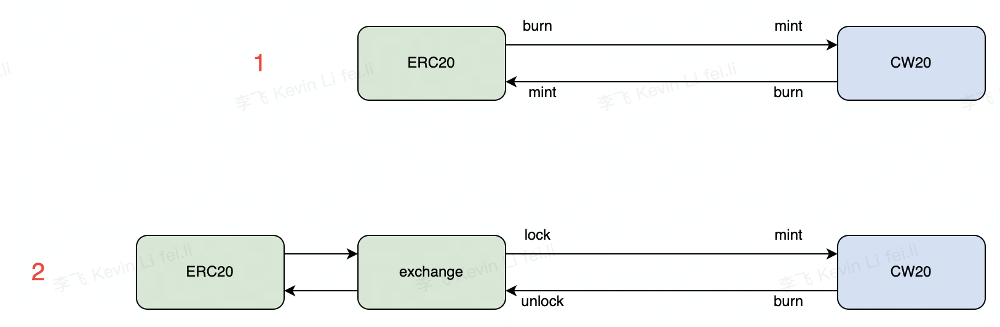

#VMBridge
VMBridge provides OKC with a channel for exchanging EVM's ERC20 tokens and WASM's CW20 tokens. You can circulate your tokens in EVM and WASM by compiling a contract pair. Below is a schematic design diagram of VMBridge:


EVM contracts follow 2 kinds of protocols:  
1. When the contract converts ERC20 to CW20, it must throw out SendToWasmEvent (WASM contract address, mintCW20 method, method input parameter), mintCW20 used for calling wasm contracts from EVM contracts.
2. When the contract accepts CW20 to exchange to ERC20, the contract must implement the mintERC20 method. Used for receiving calls from wasm contracts.

Wasm contracts follow 2 kinds of protocols:  
1. When the contract converts CW20 to ERC20, it must throw out SubCustomEVMMsg (ERC contract address, mintERC20 method, method input parameter), mintERC20 method is used for calling EVM contract from wasm contract.
2. When the contract accepts ERC20 to exchange to CW20, the contract must implement the mintCW20 method. Used for receiving calls from EVM contracts.

## Example of application
**We provide an [example](https://github.com/okex/VMTokenBridge) contract of how to use VMBridge**

### Example 1
ERC20 and CW20 contracts follow VMBridge rules (suitable for newly issued token projects). When the user exchanges ERC20 for CW20 tokens, the call for the method of exchanging CW20 tokens in the ERC20 contract is initiated. The ERC20 side burns the corresponding token and calls the CW20 contract, and the CW20 side mints the corresponding token. The same applies vice versa.
### Example 2
For the existing ERC20 contracts on the chain, if you do not want to upgrade the ERC20 contracts, you can choose the method in example 2. To implement an exchange contract, when the user needs to exchange ERC20 for CW20, approve the corresponding tokens to the exchange contract. Then, when the user calls the exchange contract to exchange with the CW20 token method, the user's ERC20 token is transferred into the lock account by means of transferfrom, and the CW20 contract is called, causing the CW20 side contract to mint out the corresponding token. The same applies vice versa.

## Detailed explanation of development rules
To make your contract initiate CW20 exchange for ERC20, you must develop an EVM ERC20 contract and a wasm CW20 contract; each contract must obey the following rules.
### EVM contract rules
Rid of the following actions in order to exchange ERC20 for CW20 tokens. (equivalent to calling the mintCW20 method of the CW20 contract, wasmAddr is the wasm contract address, recipient is the cw20 token receiving address, and amount is the number of cw20 tokens)
```solidity
event __OKCSendToWasm(string wasmAddr, string recipient, uint256 amount);
```
Define unique module account in OKC
```solidity
address public constant moduleAddress = address(0xc63cf6c8E1f3DF41085E9d8Af49584dae1432b4f);
```
The EVM contract must define the mintERC20 method for receiving the ERC20 request for CW20 token conversion. Caller is the caller's address (usually the wasm contract address), recipient is the erc20 token receiving address, and amount is the number of erc20 tokens.
- Note: You must judge whether the method of msg.sender is moduleAddress, otherwise call this method for non-wasm contracts.
- Note: It must be determined whether the caller of this method is the specified wasmContractAddress, otherwise the method is called for a non-specified wasm contract.

```solidity
function mintERC20(string calldata caller, address recipient,uint256 amount) public returns (bool) {
        require(msg.sender == moduleAddress); 
        require(keccak256(abi.encodePacked(caller)) == keccak256(abi.encodePacked(wasmContractAddress)));
        _mint(recipient, amount);
        return true;
  }
```

### Wasm contract rules
The execution of the wasm contract is to throw out the Msg type to exchange CW20 for ERC20 (equivalent to calling the mintERC20 method of ERC20)

- Wasm contract must initiate SendToEvmMsg, and make this Msg to CosmosMsg::Custom subclass
- Sender is wasm contract address (call the caller of the EVM contract)
- Contract is EVM contract address
- Recipient is recipient for erc20 tokens
- Amount is amount for erc20 tokens

```rust
pub struct SendToEvmMsg {
    pub sender: String, 
    pub contract: String, 
    pub recipient: String, 
    pub amount: Uint128,
}

impl Into<CosmosMsg<SendToEvmMsg>> for SendToEvmMsg {
    fn into(self) -> CosmosMsg<SendToEvmMsg> {
        CosmosMsg::Custom(self)
    }
}

impl CustomMsg for SendToEvmMsg {}
```

Wasm contract must initiate this method to be used for receiving the request of exchanging ERC20 to CW20.

- Inside the method, it is necessary to judge whether info.sender (method caller) is the specified evmContractAddress, otherwise the method is called for the non-specified evm contract.
- Recipient is for erc20 token receiving address
- Amount is for erc20 token amount

```rust
pub enum ExecuteMsg {
    MintCW20 {
        recipient: String, 
        amount: Uint128,  
    }
}
```
