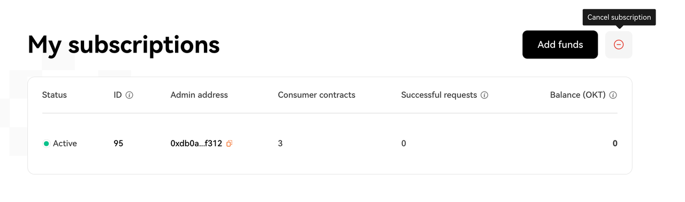
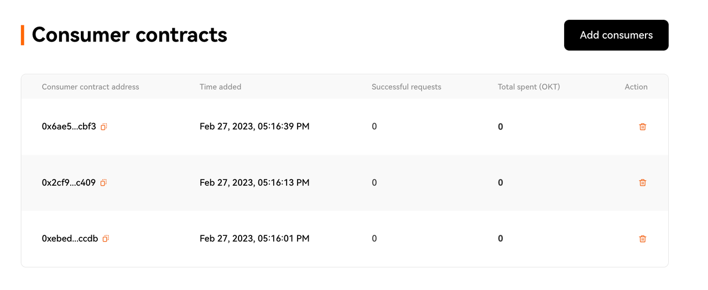
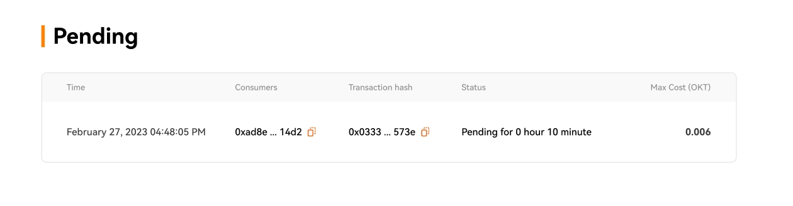
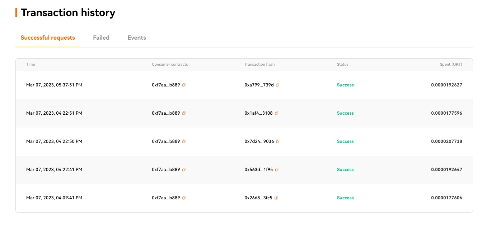
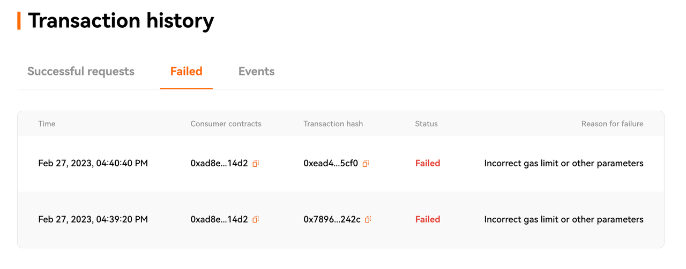
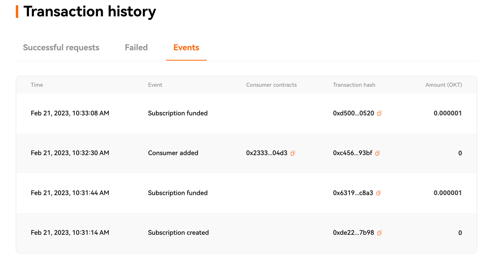

# Subscription Manager User Interface

Subscription Manager User Interface

The Subscription Manager lets you create a subcription and pre-pay for VRF so you don’t need to provide funding each time your application requests randomness. This guide walks you through the main sections of the UI.

## **My subscription**

Subscription components:

<1> **Status**: Indicates if the subscription is still active or not.

<2> **ID**: The unique subscription identifier. Approved consuming contracts use OKT from this subscription to pay for each randomness request.

<3> **Admin address**: The account address that owns this subscription ID.

<4> **Consumers contracts**: The number of consuming contracts that are approved to make VRF requests using this subscription.

<5> **Successful requests**: The number of successful randomness requests that are already completed.

<6> **Balance(OKT)**: The amount of OKT remaining to be used for requests that use this subscription.

You can cancel your subscription in the user interface. When you cancel your subscription, specify the account address to receive the remaining balance. 

## Consumer contracts

The Consumers section lists the contracts that are allowed to use your subscription to pay for requests.

<1> **Consumer contracts address**: The address of the consuming contract.

<2> **Time added**: The time when the consumer was added to the subscription.

<3> **Successful requests**: The last time a VRF request was fulfilled for the consumer.

<4> **Total spent(OKT)**: The total amount of OKT that has been used by the consuming contract.

You can use this section to **add** or **remove** consumer contracts.

## Pending

The Pending list appears if there are requests currently being processed.

<1> **Time**: The time when the pending VRF request was made.

<2> **Consumer contract**: The address of the consuming contract.

<3> **Transaction hash**: The transaction hash of the pending VRF request.

<4> **Status**: A timer that informs you how long a pending VRF request has been waiting.

<5> **Max Cost(OKT)**: The calculated total gas cost in OKT based on the configuration. See [VRF v2 Subscription Limits](../SubScription.md) for details.

## Transaction history

### Successful requests

The Successful requests tab shows the details for successful VRF fulfillments.

<1> **Time**: The time and block number indicating when the VRF request was successfully fulfilled.

<2> **Consumer contract**: The address of the consuming contract that initiated the VRF request.

<3> **Transaction Hash**: The transaction hash of the VRF callback.

<4> **Status**: The status of the request. Recent fulfillments always show **Success**.

<5> **Spent(OKT)**: The total amount of OKT spent to fulfill the VRF request.

### Failed

The Failed requests tab displays failed VRF requests.

<1> **Time**: The time when the VRF request was made.

<2> **Consumer contracts**: The address of the consuming contract.

<3> **Transaction Hash**: This can be the transaction hash of the VRF callback if the callback failed.

<4> **Status**: The status of the request. Failed requests always show **Failed**.

<5> **Reason for failure**: The reason why the request failed. Requests fail for one of the following reasons:

- Incorrect gas limit or other parameters
- Insufficient OKT balance in the subscription

### Events

The Events tab displays events linked to the subscription. There are five main events:

<1> **Subscription created**

<2> **Subscription funded**

<3> **Consumer added**

<4> **Consumer removed**

<5> **Subscription canceled**

Components of VRF events:

<1> **Time**: The time when the event happened.

<2> **Event**: The type of event.

<3> **Transaction Hash**: The transaction hash for the event.

<4> **Consumer contract**: The address of the consuming contract. This is used only for *Consumer added* and *Consumer canceled* events.

<5> Amount(OKT):

- For **Subscription funded** events, this indicates the amount of OKT added to the subscription balance.
- For **Subscription canceled** events, this indicates the amount of OKT withdrawn from the subscription balance.

