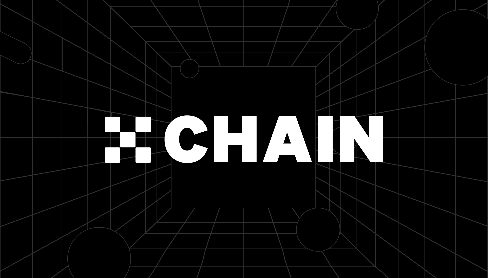

# Introduction to OKT Chain (OKTC)

## What is OKTC？

### About OKT Chain
A Super Scalable, Compatible L1 Blockchain OKT Chain (OKTC) is an EVM-compatible L1 built on Cosmos with a focus on true interoperability (IBC) and maximized performance. At high scalability, developers can build and scale with low gas fees. The OKT Chain ecosystem and infrastructure, including the all-in-one multi-chain Web3 interface, enables a seamless experience for both developers and users.

### Advantages of OKT Chain

- High Scalability & Maximized Performance: Based on enhanced Tendermint and Delegated Proof of Stake (DPoS) consensus that can support up to 5000 Transactions per Second (TPS), Web3 applications shall reach their full potential at extremely low cost.
- Enhanced Interoperability: OKT Chain supports Inter-Blockchain Communication (IBC)nprotocol that — together with the Tendermint consensus algorithm, featuring instant finality — can be used to realize value transmission between Cosmos ecosystem within seconds. Being fully EVM compatible, OKT Chain allows developers to build projects without any learning cost.
- Developer Friendly: OKT Chain is completely open-source. Anyone can read it, check the progress, comment on it, and help build the ecosystem. OKT Chain also provides native oracle protocol and industry-leader Chainlink for maximum flexibility to access price feeds.
- Secure: The OKT Chain team offers a reliable smart contract auditing service, making it a genuinely decentralized protocol that avoids the centralization risks of most blockchain networks today.

## What is Blockchain Middleware？

Blockchain developers normally fall into one of three buckets:

- Base Layer Developer or Core Contributor: responsible for developing the underlying technology for blockains. Public chain development has a long R&D cycle & high barrier to entry because of the cryptography, security, and distributed consensus backgrounds required to meaningfully contribute.

As the development of the Internet, public chains would undertake more complex business with the maturity of blockchain technology. Therefore, decentralized business will require an in-depth development environment. OKTC is just designed for these developers.

- App Developer: uses the tools developed by Blockchain Infrastructure developers to build user facing (consumer or enterprise) applications. Primarily relies on Web2 skills like frontend, design, product sense, to integrate blockchain technology or create new use cases for it.

Based on that, OKTC proposes the concept of "blockchain middleware" to reduce the development cost for application developers.

In a Web App, Middleware enables applications to share information and resources between different technical architectures,such as process scheduling, message queue, data storage, transaction processing, etc., and it is widely used in energy, telecommunications, finance, banking, medical care, education and other industry software, reducing the software development cost.

OKTC can be best thought of as "blockchain middleware", reducing the development cost for application developers up and down the stack.

Do you have OKT tokens? With OKT, you have the unique ability to contribute to the security and governance of the OKTC. Delegate your OKT to one or more of the 100 validators on the OKTC blockchain to earn more OKT through Proof-of-Stake. You can also vote with your OKT to influence the future of the OKTC through on-chain governance proposals.

## The OKT

Do you have OKT tokens? With OKT, you can contribute to the security and governance of OKTC. Delegate your OKT to one or more of the 30 validators on OKTC blockchain to earn more OKT through Delegated Proof-of-Stake. You can also vote with your OKT to influence the future of OKTC through on-chain governance proposals.

Validator requirements: Validators are required to stake at least 10,000 OKT. Additional OKT must be deposited to submit a chain-governance proposal or execute an order pending operation.

OKT holders obtain voting rights by staking their tokens. One address can vote for up to 30 different validator candidates, and the number of votes for each validator candidate that the address has supported is equivalent to the amount of OKT the address has staked (1 OKT = 1 vote).

Learn more about [being a delegator](/dev/core-concepts/delegator/delegators-faq.html).

## OKTC Explorer

The OKTC block explorer allows you to search, view and analyze OKTC data—like blocks, transactions, validators as well as other key information.
- [OKlink](https://www.oklink.com)

`exchaincli` is a command-line interface that lets you interact with the OKT Chain. `exchaincli` is the only tool that supports 100% of the OKT Chain features, including accounts, transfers, delegation, and governance. Learn more about exchaincli with the [delegator's CLI guide](/dev/core-concepts/delegator/delegators-guide-cli.html).

## OKTC CLI

`exchaincli` is a command-line interface that lets you interact with the OKTC. `exchaincli` is the only tool that supports 100% of the OKTC features, including accounts, transfers, delegation, and governance. Learn more about exchaincli with the [delegator's CLI guide](/dev/core-concepts/delegator/delegators-guide-cli.html).

## Running a full-node on the OKTC Testnet

In order to run a full-node on the OKTC testnet, you must first [install `exchaind`](/dev/quick-start/install-oktc.html). Then, follow [the guide](/dev/quick-start/install-oktc.html).

If you would like to run a validator node, follow the [validator setup guide](/dev/core-concepts/validator/validators-guide-cli.html).

