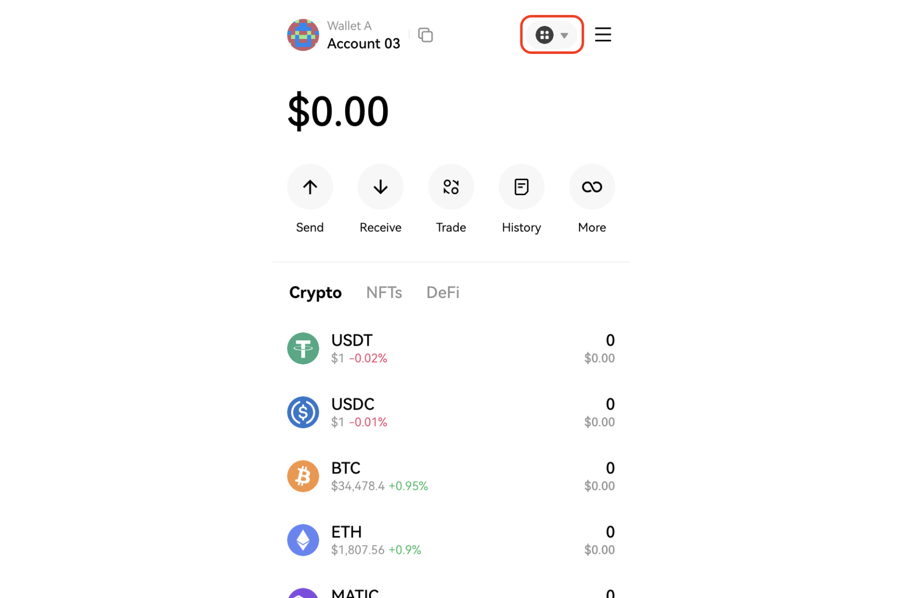

# OKX Wallet
## Swtiching to OKTC in OKX Wallet
1. Unlock your OKX Wallet and click the network selection icon in the upper right corner, which is selected as All networks by default.

2. Input **OKTC** in the search bar and select OKTC network.

You are now on the OKTC network.
