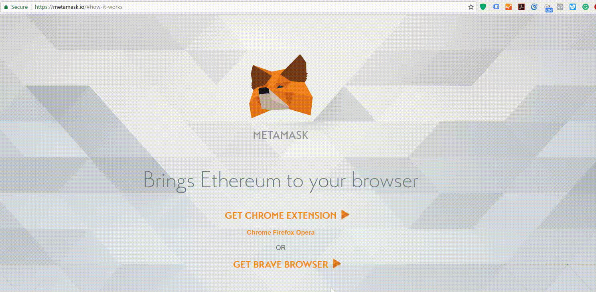
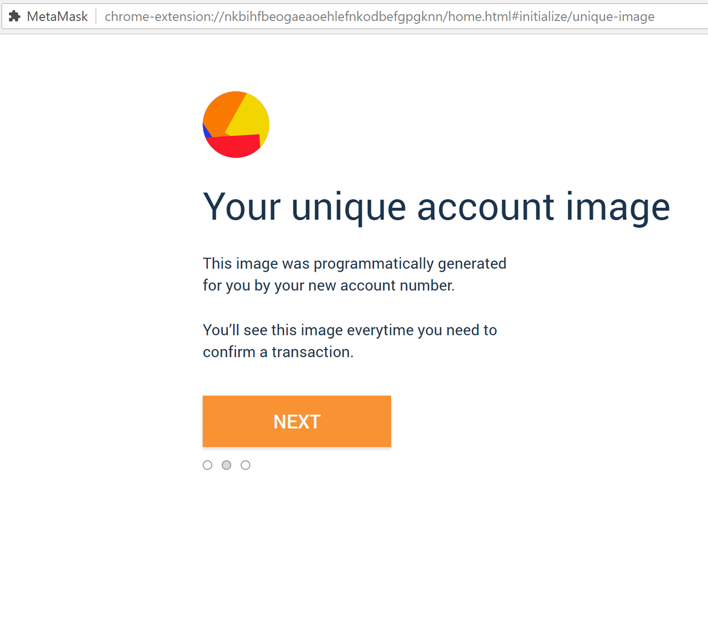
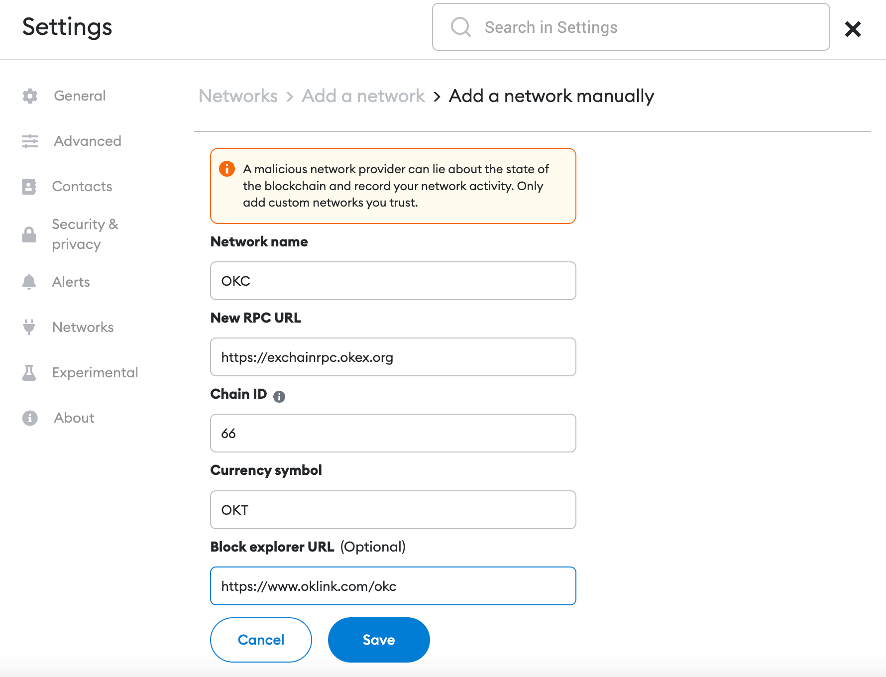

# MetaMask

## Install the Wallet application

1. To use Web3 wallet: visit [Web3 Wallet](https://www.okx.com/cn/web3), download Web3 wallet, follow the instructions to create an account, and do not forget your login password and mnemonic phrases etc, also create backups. 
2. To use Metamask: visit [Metamask](https://metamask.io/) , download Metamask, follow the instructions to create an account, and do not forget your login password and mnemonic phrases etc, also create backups.
3. Currently, TokenPocket, Bitkeep, ONTO and HyperPay already support OKC. For details, check the tutorials of each wallet's official website.

## Create a Wallet 

1. Click on the MetaMask icon in the upper right corner to open the extension.

2. To install the latest version of MetaMask, click “**Try It Now**”.

3. Click "**Continue**".

4. You will be asked to create a new password. Create a strong password and click "**Create**".

5. Proceed by clicking "**Next**",  then accept the "**Terms of Use**".

6. Click "**Reveal secret words**".

7. You will see a 12 word seed phrase. Save seed words as a file or copy them to a safe place and click Next.

8. Reveal secret words and copy your secret backup phrase to a safe place.

9. Verify your secret phrase by selecting the previously generated phrase. When done, click "**Confirm**".

**Congratulations**! You have successfully created your MetaMask account. A new wallet address was automatically generated for you!

## Add OKC Network

The Web3 wallet is a multi-chain wallet that has already been configured with the OKC network by default, hence the user does not need to add it themselves.

If the user is using Metamask wallet, they should: Click on Ethereum's main site; Select custom RPC in the drop-down menu; Click "**Add a network**"; Enter the following info below on the pop-up form：

> - **Network name**: OKC (can also customize)
> - **New RPC URL88**: https://exchainrpc.okex.org
> - **Chain ID**: 66
> - **Symbol**: OKT
> - **Blockchain browser URL**: https://www.oklink.com/en/okc

## Get OKT

OKT is the native token of OKC, which is similar to Ether in Ethereum. To interact with OKC, OKT payments act as gas fees.

On the OKC chain, OKTs function as native tokens. This means that a user can pay gas with OKT as well as send OKT to other accounts the same way they use ETH to pay gas fees on Ethereum and send ETH to others.

> **OKT can be purchased from**: [OKT-USDT](https://www.okx.com/cn/trade-spot/okt-usdt)

## OKC Social Media

>- **OKC Homepage**：[OKC Homepage](https://www.okx.com/okc)
>- **OKC Docs**：[OKC Docs](https://exchainrpc.okex.org/docs/en/#overview)
>- **GitHub**: [OKC Github](https://github.com/okx/exchain)
>- **Telegram**：[OKC Telegram](https://t.me/OKCNetwork)
>- **Discord**：[OKC Discord](https://discord.com/invite/2rynEUqJxP)
>- **Medium**：[OKC Medium](https://medium.com/okc-okx-chain)