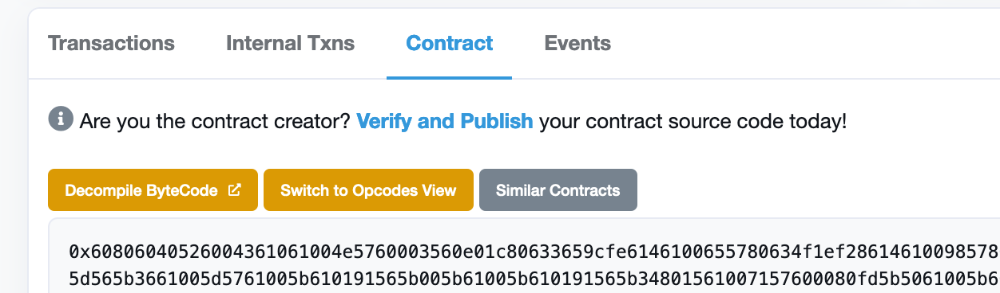

# Verify proxy contract
## How to Verify proxy contract
Please learn how to deploy an upgradable KIP20 contract <!--here-->
## Flatten your contract
### Install flattener
```npm install truffle-flattener -g```

Run the following command:
```
$ truffle-flattener KIP20TokenImplementation.sol > KIP20TokenImplementationFlattened.sol
$ truffle-flattener KIP20UpgradeableProxy.sol > KIP20UpgradeableProxyFlattened.sol"
```
## Compile and deploy your contract with Remix
### Compile Implementation contract
- Open Remix IDE:[https://remix.ethereum.org](https://remix.ethereum.org)
- Select solidity language
- Create new contract KIP20Token.sol and copy contract code from flattened KIP20TokenImplementationFlattened.sol
- Compile the implementation contract
- Click on this button to switch to the compile page
- Select “KIP20TokenImplementation” contract
- Enable “Auto compile” and “optimization”
- Click “ABI” to copy the contract abi and save it.
## Deploy the implementation contract
- Select “Injected Web3”
- Select “KIP20TokenImplementation” contract
- Click the **‘Deploy’** button and Metamask will pop up
- Click the **‘Confirm’** button to sign and broadcast the transaction to OKTC.
- Then, you need to initialize the token: fill in all the parameters and click on “transact”

> Note: Owner should be the address who send the deploy transaction before.
- Click on the “Copy” icon to save the initializatioin data: Like the following: 
```0xef3ebcb800000000000000000000000000000000000000000000000000000000000000c00000000000000000000000000000000000000000000000000000000000000100000000000000000000000000000000000000000000000000000000000000001200000000000000000000000000000000000000000000000000000000000f42400000000000000000000000000000000000000000000000000000000000000001000000000000000000000000fc41d5571120442d1bb82cea0884966e543cb78b000000000000000000000000000000000000000000000000000000000000000548656c6c6f000000000000000000000000000000000000000000000000000000000000000000000000000000000000000000000000000000000000000000000548454c4c4f000000000000000000000000000000000000000000000000000000```
- Confirm your transaction in MetaMask

## Compile proxy contract
- Create new contract proxy.sol and copy contract code from flattened
`KIP20UpgradeableProxyFlattened.sol`. <!--Here is and [example]()-->
- Compile the proxy contractClick on this button to switch to the compile page
- Select “KIP20UpgradeableProxy” contract
- Enable “Auto compile” and “optimization”Click “ABI” to copy the contract abi and save it.
## Deploy the proxy contract
- Select “Injected Web3”Select “KIP20UpgradeableProxy.sol” contract
- Fill in the parameter
<!---->
Logic: The address of KIP20Implementation contract Admin: admin cannot be KIP20 token owner
Data: use the initialization data you saved before
- Click the **‘Deploy’** button and Metamask will pop up
- Click the **‘Confirm’** button to sign and broadcast transaction to OKTC.
## Verify proxy contract on OKLink
Note: The way to verify the KIP20TokenImplementation contract is the same as before.
- Go to your contact page and click on “Verify and Publish”

-Select Single file

- Copy your contract code below and check “Optimization” if it’s enabled
- Contractor Data: Please use this site for getting the correct constructor data: https://abi.hashex.org/#

First, you need to copy ABI json of “KIP20UpgradeableProxy.sol” contractThen, click on “Parse”

Add all those 3 parameters as indicated. Then copy/paste the result.

That’s it! You have verified your proxy contract.

## Link these two contracts
- Click on “More Options” and choose “is this a proxy”.

- Verify your proxy address

Confirm the implementation address.

If you go back to the contract page and you can see two more buttons **‘Read as proxy’** and **‘Write as proxy’**.

